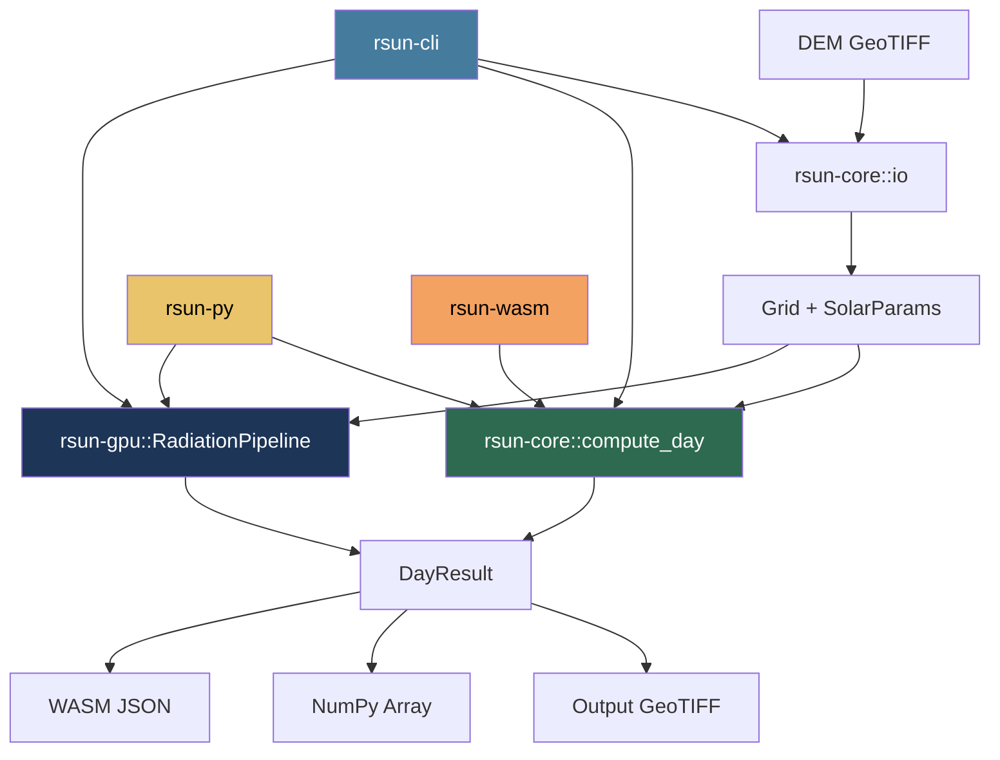

# Rust Solar Toolkit (rsun)

`rsun` is a Rust port of [GRASS GIS r.sun](https://grass.osgeo.org/grass-stable/manuals/r.sun.html) — a complete implementation of the ESRA clear-sky solar radiation model (Hofierka & Suri, 2002). It computes global solar radiation and sunshine duration on arbitrary terrain, with CPU parallelism, GPU acceleration, and multi-platform deployment.

## Why Rust?

| Goal | How rsun achieves it |
|------|---------------------|
| **Performance** | Rayon auto-parallelism over all pixels; wgpu GPU compute shaders |
| **Portability** | Single CLI binary, Python wheel (PyO3), WebAssembly for browsers |
| **Safety** | Rust's type system prevents memory bugs; formal Lean 4 proofs verify math |
| **Independence** | No GRASS GIS installation required; reads/writes GeoTIFF directly via GDAL |

## Architecture



### Crate Workspace

| Crate | Purpose | Key Dependencies |
|-------|---------|-----------------|
| `rsun-core` | CPU reference implementation | `rayon`, `gdal` (optional) |
| `rsun-cli` | Command-line binary | `clap`, `rsun-core`, `rsun-gpu` |
| `rsun-gpu` | GPU acceleration | `wgpu`, `bytemuck` |
| `rsun-py` | Python bindings | `pyo3`, `numpy` |
| `rsun-wasm` | WebAssembly module | `wasm-bindgen`, `serde` |

### Core Module Map

| Module | Algorithms |
|--------|-----------|
| `solar.rs` | Solar declination (Spencer 1971), corrected solar constant, sunrise/sunset times, solar altitude & azimuth, hour angle conversion |
| `radiation.rs` | Beam radiation with atmospheric refraction and Kasten-Young air mass, diffuse radiation (Suri/ESRA model), reflected radiation, cosine of incidence angle (Jenco transform) |
| `horizon.rs` | Ray-marching horizon angles in N azimuthal directions, bilinear interpolation |
| `terrain.rs` | Slope and aspect from DEM via Horn's 3x3 weighted finite difference method |
| `io.rs` | GeoTIFF I/O via GDAL, automatic CRS detection and lat/lon reprojection |

## Algorithm Correspondence

Every rsun function maps directly to a GRASS r.sun routine and a Lean 4 formal definition:

| Algorithm | GRASS r.sun | Rust (`rsun-core`) | Lean 4 (`EEMTVerify.Solar`) |
|-----------|-------------|--------------------|-----------------------------|
| Solar declination | `com_declin()` | `solar::declination()` | `Declination.declination` |
| Corrected solar constant | `com_sol_const()` | `solar::corrected_solar_constant()` | `SolarConstant.correctedSolarConstant` |
| Sunrise & sunset | `com_par_const()` | `solar::sunrise_sunset()` | `SunriseSunset.sunriseHour` / `sunsetHour` |
| Solar position | `com_par()` | `solar::solar_position()` | `SolarPosition.solarAltitude` |
| Hour angle | — | `solar::hour_to_time_angle()` | `SunriseSunset.hourToTimeAngle` |
| Beam radiation | `brad()` | `radiation::brad()` | `BeamRadiation.beamTilted` + `AirMass.*` |
| Diffuse + reflected | `drad()` | `radiation::drad()` | `DiffuseRadiation.*` |
| Cos incidence | `lumcline2()` | `radiation::cos_incidence()` | `CosIncidence.cosIncidence` |
| Daily integration | `joules2()` | `compute_day()` | `TotalRadiation.dailyRadiation` |
| Slope & aspect | `r.slope.aspect` | `terrain::slope_aspect()` | — |
| Horizon angles | `r.horizon` | `horizon::compute_horizons()` | — |

## Lean 4 Proven Properties

The Lean 4 theorem prover has formally verified mathematical bounds on every core equation. These bounds are also validated at runtime by unit tests in `rsun-core/tests/lean4_validation_tests.rs`.

| Lean 4 Theorem | Proven Bound | Rust Validated |
|----------------|-------------|----------------|
| `declination_bounded` | $\delta \in [-\arcsin(0.3978),\; \arcsin(0.3978)]$ (~±23.44°) | All 365 days |
| `eccentricityFactor_lower` / `_upper` | Factor $\in [0.96656,\; 1.03344]$ | All 365 days |
| `correctedSolarConstant_default_range` | $G \in [1321,\; 1413]$ W/m² at $G_0 = 1367$ | All 365 days |
| `hourToTimeAngle_noon` | $\omega(12) = 0$ | Exact |
| `sunrise_sunset_sum` | sunrise + sunset $= 24$ | Multiple latitudes |
| `dayLength_nonneg` / `_le_24` | Day length $\in [0,\; 24]$ hours | All lat/day combos |
| `equinox_twelve_hours` | Day length $= 12$ h when $\delta = 0$ | Multiple latitudes |
| `solarAltitude_bounded` | Altitude $\in [-\pi/2,\; \pi/2]$ | Sampled positions |
| `noon_altitude_max` | Noon altitude is daily maximum | Multiple latitudes |
| `beamTransmittance_pos` / `_le_one` | Transmittance $\in (0,\; 1]$ | Sampled conditions |
| `elevationCorrection_antitone` | Correction decreasing with altitude | 0–8848 m |
| `beamTilted_zero_facing_away` | Beam $= 0$ when $s_0 \le 0$ | Direct test |
| `beamTilted_zero_night` | Beam $= 0$ when altitude $\le 0$ | Direct test |
| `beamTiltedSimplified_le_gExt` | Beam $\le G_\text{ext}$ | Sampled conditions |
| `view_factors_sum_one` | $F_\text{sky} + F_\text{terrain} = 1$ | Multiple slopes |
| `reflectedRadiation_flat` | Reflected $= 0$ when slope $= 0$ | Direct test |
| `reflectedRadiation_nonneg` | Reflected $\ge 0$ | Sampled conditions |
| `dailyRadiation_nonneg` | Daily total $\ge 0$ | Synthetic DEM |
| `insolation_le_dayLength` | Insolation $\le$ day length | Synthetic DEM |

## Performance

### CPU (rsun-core)

- **Parallelism**: Rayon distributes pixel computation across all available cores
- **Time complexity**: $O(\text{pixels} \times \text{time\_steps})$ per day, where time steps $= \lceil\text{day\_length} / \text{step}\rceil$
- **Step impact**: `step=0.5` (default) gives ~24 steps/day; `step=0.25` doubles compute time for ~1% accuracy gain

### GPU (rsun-gpu)

- **Backend**: wgpu compute shaders (WGSL) — works on Vulkan, Metal, DX12
- **Pipeline**: Two-pass: (1) horizon pre-computation, (2) per-pixel daily radiation loop
- **Workgroup size**: 64 threads per workgroup, 2D dispatch for large DEMs
- **Fallback**: Auto-detects GPU; falls back to CPU if unavailable

## CLI Reference

```
rsun compute --dem <PATH> --day <SPEC> [OPTIONS]
rsun terrain --dem <PATH> --slope-out <PATH> --aspect-out <PATH>
rsun info
```

### `compute` Options

| Flag | Default | Description |
|------|---------|-------------|
| `--dem` | — | Input DEM GeoTIFF (required) |
| `--day` | — | Day spec: `"172"`, `"1-365"`, or `"all"` |
| `--step` | 0.5 | Time step in decimal hours |
| `--linke` | 3.0 | Linke turbidity factor |
| `--albedo` | 0.2 | Surface albedo |
| `--gpu` | auto | GPU mode: `"auto"`, `"cpu"`, or device index |
| `--glob-rad` | — | Output global radiation GeoTIFF (single-day) |
| `--insol-time` | — | Output insolation time GeoTIFF (single-day) |
| `--output-dir` | — | Output directory (multi-day) |

## Python API

```python
import rsun

# From file (requires GDAL at build time)
result = rsun.compute_day_from_file("dem.tif", day=172, step=0.5, linke=3.0, albedo=0.2)
result.glob_rad    # numpy array [Wh/m²]
result.insol_time  # numpy array [hours]

# From numpy arrays
result = rsun.compute_day(dem, slope, aspect, lat, lon, day=172)

# Terrain analysis
slope, aspect = rsun.compute_terrain(dem, ew_res=10.0, ns_res=10.0)

# GPU info
gpus = rsun.gpu_info()  # list of available GPU adapters
```

## WebAssembly API

```javascript
import init, { compute_day } from './rsun_wasm.js';
await init();

const result = compute_day(dem_array, rows, cols, lat_rad, lon_rad, day, step);
// result.glob_rad  — Float32Array
// result.insol_time — Float32Array
```

CPU-only; limited to DEMs under 1 million pixels.

## Validation Against GRASS r.sun

The `validation/compare.sh` script runs rsun and GRASS r.sun on the same DEM (`mcn_10m.tif`) for 4 representative days (winter solstice, spring equinox, summer solstice, fall equinox) and computes:

- **RMSE** — Root mean square error across all valid pixels
- **MaxRelErr%** — Maximum relative error at any pixel

**Acceptance criteria**: MaxRelErr < 5% for all days.

```bash
cd rsun && bash validation/compare.sh
```

## References

1. Hofierka, J. & Suri, M. (2002). The solar radiation model for Open Source GIS: implementation and applications. *Proceedings of the Open Source GIS - GRASS Users Conference*.
2. Spencer, J.W. (1971). Fourier series representation of the position of the Sun. *Search*, 2(5), 172.
3. Kasten, F. & Young, A.T. (1989). Revised optical air mass tables and approximation formula. *Applied Optics*, 28(22), 4735–4738.
4. Jenco, M. (1992). Distribution of direct solar radiation on georelief. *Geograficky Casopis*, 44, 342–355.
5. Suri, M. & Hofierka, J. (2004). A new GIS-based solar radiation model and its application to photovoltaic assessments. *Transactions in GIS*, 8(2), 175–190.
