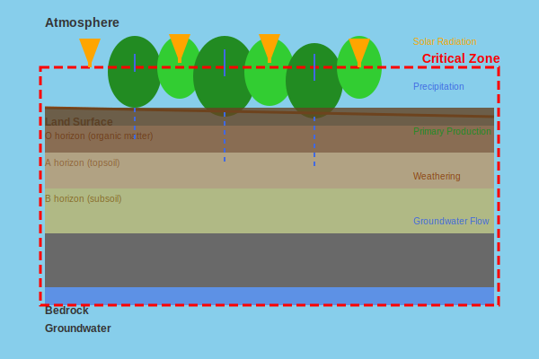

# Scientific Background

## What is the Critical Zone?

The **Critical Zone** is Earth's near-surface environment extending from the top of the vegetation canopy down to the groundwater. This zone supports all terrestrial life and controls:

- Fresh water availability and quality
- Soil formation and agricultural productivity  
- Carbon storage and climate regulation
- Biodiversity and ecosystem services
- Natural hazard mitigation

<figure markdown>
  
  <figcaption>The Critical Zone extends from the vegetation canopy to groundwater, encompassing the zone where rock, soil, water, air, and living organisms interact.</figcaption>
</figure>

## Energy and Mass Transfer Principles

### Thermodynamic Foundation

The Critical Zone operates as an **open thermodynamic system** where:

- Energy and mass flow down gradients (solar, chemical, gravitational)
- Internal structures develop to optimize energy dissipation
- System organization emerges from energy flux patterns
- Steady-state conditions balance inputs and outputs

$$\frac{d\mathcal{U}_{CZ}}{dt} = \mathcal{K} - T\sigma$$

Where:

- **𝒰CZ** = Critical Zone energy storage [J m⁻²]

- **𝒦** = Energy flux through the system [W m⁻²]  

- **T** = System temperature [K]

- **σ** = Entropy production rate [W m⁻² K⁻¹]

### Energy Balance Components

The total energy flux includes multiple components:

$$E_{Total} = E_{ET} + E_{PPT} + E_{BIO} + E_{ELEV} + E_{GEO} + \sum E_i$$

| Component | Description | Magnitude | Role |
|-----------|-------------|-----------|------|
| **EET** | Evapotranspiration | ~10⁵ MJ m⁻² yr⁻¹ | Returns to atmosphere |
| **EPPT** | Precipitation energy | ~10² MJ m⁻² yr⁻¹ | Subsurface heat transfer |
| **EBIO** | Primary production | ~10¹ MJ m⁻² yr⁻¹ | Biological energy storage |
| **EELEV** | Gravitational potential | ~10⁰ MJ m⁻² yr⁻¹ | Physical denudation |
| **EGEO** | Chemical potential | ~10⁻¹ MJ m⁻² yr⁻¹ | Chemical weathering |

### EEMT Focus

**Effective Energy and Mass Transfer** focuses on subsurface energy flux:

$$\text{EEMT} = E_{BIO} + E_{PPT}$$

This represents the energy **effectively transferred** to drive:

- Soil formation processes
- Chemical weathering reactions  
- Biological productivity
- Carbon sequestration
- Nutrient cycling

## Physical Processes

### Solar Radiation and Topography

Solar radiation provides the primary energy input to the Critical Zone. Topographic effects modify radiation through:

#### Slope and Aspect Effects

- **Pole-facing (N,S) slopes**: Reduced direct radiation, higher soil moisture
- **Equator-facing slopes**: Maximum radiation, increased evapotranspiration  
- **Slope angle**: Controls radiation intensity and duration

#### Shading and Obstruction

- **Horizon effects**: Adjacent terrain blocks incoming radiation
- **Vegetation shading**: Canopy intercepts and redistributes energy
- **Seasonal variation**: Sun angle changes modify topographic effects

### Water and Energy Coupling

Water acts as both a mass flux and energy carrier:

#### Precipitation Energy (EPPT)
$$E_{PPT} = F \times c_w \times \Delta T \quad \text{[W m}^{-2}\text{]}$$

Where:

- **F** = Effective precipitation flux [kg m⁻² s⁻¹]
- **cw** = Specific heat of water (4,180 J kg⁻¹ K⁻¹)
- **ΔT** = Temperature above freezing [K]

#### Water Redistribution

- **Infiltration vs. runoff**: Controls subsurface energy delivery
- **Topographic convergence**: Concentrates water and energy flux
- **Evapotranspiration**: Returns energy to atmosphere

### Biological Energy (EBIO)

Primary production stores solar energy in chemical bonds:

#### Photosynthesis Energy Storage
$$E_{BIO} = NPP \times h_{BIO} \quad \text{[W m}^{-2}\text{]}$$

Where:

- **NPP** = Net Primary Production [kg m⁻² s⁻¹]
- **hBIO** = Specific biomass enthalpy (22 × 10⁶ J kg⁻¹)

#### Carbon-Energy Coupling

- **CO₂ fixation**: Solar energy → chemical energy
- **Decomposition**: Chemical energy → heat + nutrients
- **Root activity**: Drives chemical weathering reactions

## Critical Zone Structure and Function

### Emergent Organization

EEMT drives the formation of organized Critical Zone structures:

#### Soil Horizons

- **O horizon**: Organic matter accumulation
- **A horizon**: Mineral-organic mixing
- **B horizon**: Clay and nutrient accumulation
- **C horizon**: Weathered parent material

#### Vegetation Patterns

- **Productivity gradients**: Follow EEMT patterns
- **Species composition**: Adapted to local energy/water balance
- **Biomass allocation**: Optimizes energy capture and water access

#### Landscape Features

- **Channel networks**: Organize water and sediment transport
- **Slope profiles**: Balance weathering and erosion rates
- **Aspect patterns**: Reflect energy-controlled processes

### Threshold Behavior

EEMT exhibits critical thresholds that control system behavior:

#### Water vs. Energy Limitation
**Threshold**: ~70 MJ m⁻² yr⁻¹

- **Below threshold**: Water-limited, EBIO dominates
- **Above threshold**: Energy-limited, EPPT dominates

#### System Transitions

- **Vegetation shifts**: Grassland ↔ forest transitions
- **Soil development**: Entisol ↔ Mollisol ↔ Alfisol progression
- **Geomorphic regime**: Weathering-limited ↔ transport-limited

## Spatial and Temporal Scales

### Spatial Scale Integration

EEMT operates across multiple spatial scales:

#### Local Scale (1-100 m)

- **Process-level understanding**: Individual tree, soil pedon
- **High-resolution data**: LiDAR, field measurements
- **Detailed process modeling**: Hourly energy/water balance

#### Landscape Scale (100 m - 10 km)

- **Pattern-process relationships**: Topographic controls
- **Moderate-resolution data**: Landsat, weather stations
- **Statistical modeling**: Spatial correlation analysis

#### Regional Scale (10-1000 km)

- **Climate gradient analysis**: Elevation, latitude effects
- **Coarse-resolution data**: MODIS, climate models
- **Empirical relationships**: Broad pattern identification

### Temporal Scale Integration

#### Short-term Processes (days to years)

- **Weather variability**: Daily climate fluctuations
- **Seasonal cycles**: Vegetation phenology, soil temperature
- **Extreme events**: Drought, fire, flooding impacts

#### Medium-term Dynamics (years to centuries)

- **Climate oscillations**: El Niño, Pacific Decadal Oscillation
- **Vegetation succession**: Post-disturbance recovery
- **Soil profile development**: Horizon differentiation

#### Long-term Evolution (centuries to millennia)

- **Climate change**: Holocene environmental shifts
- **Landscape evolution**: Erosion, weathering, soil formation
- **Ecosystem migration**: Species range shifts

## Mathematical Framework

### Open System Thermodynamics

The Critical Zone energy balance follows fundamental thermodynamic principles:

#### First Law (Energy Conservation)

$$\frac{dU}{dt} = Q - W$$

Where **U** = internal energy, **Q** = heat input, **W** = work done by system

#### Second Law (Entropy Increase)

$$\frac{dS}{dt} = \frac{Q}{T} + \sigma$$

Where **S** = entropy, **σ** = irreversible entropy production

#### Exergy Concept

$$\text{Exergy} = \text{Energy} - T_0 \times \text{Entropy}$$

Exergy represents the maximum useful work extractable from the system.

### Statistical Relationships

EEMT exhibits predictable relationships with Critical Zone properties:

#### Power Law Scaling

$$\text{Biomass} = \alpha \times \text{EEMT}^{\beta}$$

Where α = 0.032 kg m² yr ha⁻¹ MJ⁻¹, β = 3.22

#### Exponential Relationships  

$$\text{Soil\_Depth} = \gamma \times \exp(\delta \times \text{EEMT})$$

For specific lithologies and climate conditions

#### Threshold Functions

$$f(\text{EEMT}) = \begin{cases}
f_1(\text{EEMT}) & \text{if EEMT} < 70 \text{ MJ/m}^2\text{/yr} \\
f_2(\text{EEMT}) & \text{if EEMT} \geq 70 \text{ MJ/m}^2\text{/yr}
\end{cases}$$

## Model Validation

### Field Validation Studies

EEMT has been validated against multiple field datasets:

#### Soil Properties

- **Soil depth**: r² = 0.77 for topographic EEMT
- **Clay content**: Significant correlation across climate gradients
- **Organic matter**: Strong relationship in temperate systems
- **Chemical weathering**: Linear correlation in humid environments

#### Vegetation Properties  

- **Aboveground biomass**: Power law relationship (r² = 0.98)
- **Leaf area index**: Moderate correlation in forest systems
- **Net primary production**: Good agreement with flux tower data
- **Species composition**: Predictive of functional groups

#### Geomorphic Properties

- **Erosion rates**: Inverse relationship in high-EEMT systems
- **Chemical denudation**: Linear increase with EEMT
- **Regolith thickness**: Exponential relationship
- **Landscape relief**: Controls on maximum EEMT values

---

*This framework provides the scientific foundation for understanding how energy drives Critical Zone processes and enables quantitative prediction of landscape evolution and ecosystem function.*