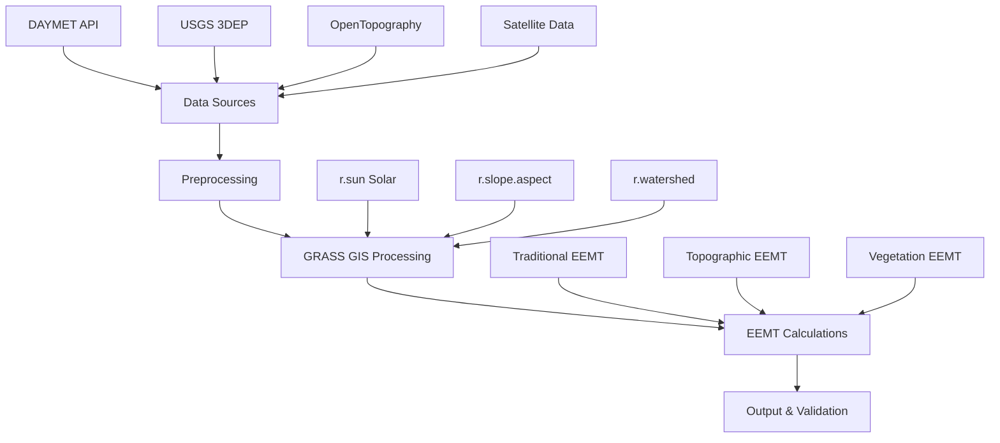

# Development Guide

## Contributing to EEMT

We welcome contributions to improve EEMT calculations, add new features, and extend documentation. This guide covers the development process and technical architecture.

## Quick Start for Developers

### 1. Fork and Clone
```bash
git clone https://github.com/your-username/eemt.git
cd eemt
git checkout 2020_update
```

### 2. Set Up Development Environment
```bash
# Create virtual environment
python -m venv eemt-dev
source eemt-dev/bin/activate

# Install development dependencies
pip install -r requirements.txt
pip install -e .
```

### 3. Run Tests
```bash
# Unit tests
pytest tests/

# Integration tests  
bash tests/integration_tests.sh

# Documentation tests
mkdocs serve
```

## Development Workflow

### Branch Strategy
- **master**: Stable releases
- **2020_update**: Active development branch
- **feature/***: New feature development
- **hotfix/***: Critical bug fixes

### Making Changes

1. **Create feature branch**
   ```bash
   git checkout -b feature/new-climate-data-source
   ```

2. **Make changes with tests**
   ```python
   # Add new functionality
   def new_climate_function():
       pass
   
   # Add corresponding tests
   def test_new_climate_function():
       pass
   ```

3. **Update documentation**
   ```markdown
   ## New Climate Data Source
   
   Description of new functionality...
   ```

4. **Submit pull request**
   - Include clear description
   - Reference any related issues
   - Ensure tests pass

## Code Standards

### Python Style
- Follow PEP 8 guidelines
- Use type hints for function signatures
- Maximum line length: 88 characters
- Use Black for code formatting

```python
from typing import Optional, Tuple
import numpy as np

def calculate_eemt(
    temperature: np.ndarray, 
    precipitation: np.ndarray,
    elevation: Optional[np.ndarray] = None
) -> Tuple[np.ndarray, np.ndarray, np.ndarray]:
    """Calculate EEMT with proper typing."""
    pass
```

### Documentation Standards
- Use Google-style docstrings
- Include examples in docstrings
- Update relevant documentation pages
- Add entries to changelog

### Testing Requirements
- Unit tests for all new functions
- Integration tests for workflows
- Performance benchmarks for algorithms
- Validation against scientific literature

## Architecture Overview

### Core Components



### Module Structure

```
eemt/
├── core/
│   ├── calculations.py     # Core EEMT functions
│   ├── constants.py        # Physical constants
│   └── validation.py       # Result validation
├── data_sources/
│   ├── elevation.py        # DEM access functions
│   ├── climate.py          # Climate data APIs
│   └── satellite.py        # Remote sensing data
├── grass_interface/
│   ├── solar.py           # r.sun wrapper functions
│   ├── terrain.py         # Terrain analysis
│   └── parallel.py        # Parallel processing
├── workflows/
│   ├── traditional.py     # Traditional EEMT
│   ├── topographic.py     # Topographic EEMT
│   └── vegetation.py      # Vegetation EEMT
└── utils/
    ├── io.py              # File I/O utilities
    ├── projections.py     # CRS handling
    └── performance.py     # Performance monitoring
```

## Performance Considerations

### Optimization Guidelines

1. **Memory Management**
   - Process large datasets in chunks
   - Use memory-mapped arrays when possible
   - Clean up temporary files promptly

2. **Parallel Processing**
   - Maximize CPU utilization with multiprocessing
   - Use thread-safe operations
   - Balance memory vs. speed tradeoffs

3. **I/O Optimization**
   - Use compressed file formats (LZW, DEFLATE)
   - Implement caching for repeated operations
   - Minimize network requests

### Benchmarking

```python
import time
import psutil
from functools import wraps

def benchmark(func):
    """Decorator for performance benchmarking"""
    @wraps(func)
    def wrapper(*args, **kwargs):
        start_time = time.time()
        start_memory = psutil.Process().memory_info().rss
        
        result = func(*args, **kwargs)
        
        end_time = time.time()
        end_memory = psutil.Process().memory_info().rss
        
        print(f"{func.__name__} performance:")
        print(f"  Time: {end_time - start_time:.2f} seconds")
        print(f"  Memory: {(end_memory - start_memory) / 1024**2:.1f} MB")
        
        return result
    return wrapper
```

## Testing Framework

### Test Structure
```
tests/
├── unit/
│   ├── test_calculations.py
│   ├── test_data_sources.py
│   └── test_grass_interface.py
├── integration/
│   ├── test_workflows.py
│   └── test_end_to_end.py
├── data/
│   ├── sample_dem.tif
│   └── sample_climate.nc
└── conftest.py
```

### Example Test
```python
import pytest
import numpy as np
from eemt.core.calculations import calculate_eemt_traditional

def test_eemt_traditional_basic():
    """Test basic traditional EEMT calculation"""
    
    # Test data
    temp = np.array([15.0, 20.0, 25.0])  # °C
    precip = np.array([50.0, 40.0, 30.0])  # mm
    
    # Calculate EEMT
    eemt, e_bio, e_ppt = calculate_eemt_traditional(temp, precip)
    
    # Assertions
    assert isinstance(eemt, np.ndarray)
    assert np.all(eemt >= 0), "EEMT should be non-negative"
    assert np.all(e_bio >= 0), "E_BIO should be non-negative"
    assert np.all(e_ppt >= 0), "E_PPT should be non-negative"
    assert np.allclose(eemt, e_bio + e_ppt), "EEMT should equal sum of components"

@pytest.mark.integration
def test_complete_workflow():
    """Test complete EEMT workflow with sample data"""
    
    from eemt.workflows import run_complete_eemt_pipeline
    
    # Use test data
    result = run_complete_eemt_pipeline(
        dem_file='tests/data/sample_dem.tif',
        climate_dir='tests/data/climate/',
        output_dir='tests/output/',
        start_year=2015,
        end_year=2015  # Single year for speed
    )
    
    assert 'traditional' in result
    assert np.any(~np.isnan(result['traditional']))
```

## Documentation Development

### MkDocs Setup
```bash
# Serve documentation locally
mkdocs serve

# Build static site
mkdocs build

# Deploy to GitHub Pages
mkdocs gh-deploy
```

### Writing Guidelines

1. **Structure**: Use clear headings and subheadings
2. **Examples**: Include working code examples
3. **Math**: Use MathJax for equations
4. **Images**: Optimize for web display
5. **Links**: Use relative links within documentation

### Documentation Testing
```bash
# Check for broken links
pytest docs/test_docs.py

# Validate markdown syntax
markdownlint docs/

# Check MkDocs configuration
mkdocs build --strict
```

## Release Process

### Version Numbering
- **Major**: Breaking API changes (2.0.0)
- **Minor**: New features, backwards compatible (2.1.0)
- **Patch**: Bug fixes (2.1.1)

### Release Checklist

1. **Update version numbers**
   ```python
   # eemt/__init__.py
   __version__ = "2.1.0"
   ```

2. **Update changelog**
   ```markdown
   ## [2.1.0] - 2025-01-15
   ### Added
   - New climate data source integration
   ### Fixed
   - Memory optimization for large datasets
   ```

3. **Run full test suite**
   ```bash
   pytest tests/ --cov=eemt
   ```

4. **Build and test documentation**
   ```bash
   mkdocs build --strict
   ```

5. **Create release tag**
   ```bash
   git tag -a v2.1.0 -m "Release version 2.1.0"
   git push origin v2.1.0
   ```

## Getting Help

### Development Support
- **GitHub Issues**: Technical questions and bug reports
- **GitHub Discussions**: Design discussions and feature requests
- **Email**: Direct contact with maintainers

### Code Review Process
- All changes require review by core maintainers
- Automated testing must pass
- Documentation must be updated
- Performance impacts should be evaluated

---

Ready to contribute? Check the sections above for detailed development instructions.