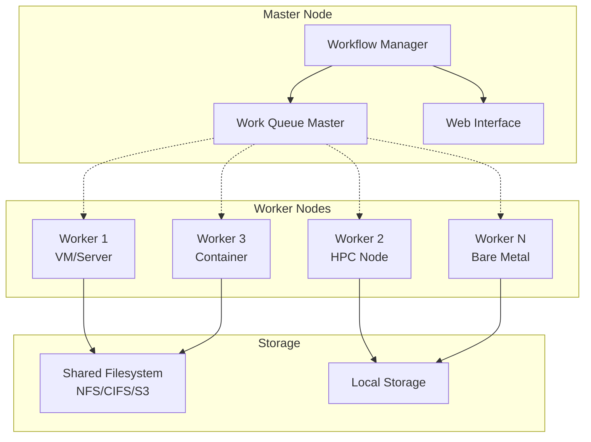

# Distributed Deployment

The EEMT workflow manager supports distributed execution across multiple virtual machines, bare metal servers, HPC systems, and HTC environments using a master/worker architecture.

## Overview

The distributed deployment consists of:

- **Master/Foreman Node**: Coordinates workflow execution, manages job queue, and distributes tasks
- **Worker Nodes**: Execute individual workflow tasks using containerized environments
- **Shared Storage**: Optional shared filesystem for large datasets



## Deployment Types

### 1. Multi-VM Deployment

**Use Case**: Research clusters, cloud environments, multi-institutional collaboration

**Setup**:
- Master VM with web interface and workflow coordination
- Multiple worker VMs with container runtime
- Shared storage via NFS, CIFS, or cloud storage

**Benefits**:
- Easy scaling by adding VM instances
- Isolated execution environments
- Cloud-native deployments

### 2. HPC Integration

**Use Case**: University HPC clusters, national computing facilities

**Setup**:
- Master node on login/head node
- Workers on compute nodes via SLURM/PBS job submission
- Shared filesystem (Lustre, GPFS, NFS)

**Benefits**:
- Leverage existing HPC infrastructure
- High-performance interconnects
- Large-scale parallel execution

### 3. HTC Grid Computing

**Use Case**: Open Science Grid, campus grids, volunteer computing

**Setup**:
- Master on submit node
- Workers on grid compute nodes
- Container-based execution for portability

**Benefits**:
- Massive scale-out capability
- Opportunistic resource usage
- Heterogeneous resource pools

## Prerequisites

### Master Node Requirements

- **OS**: Linux (Ubuntu 20.04+, CentOS 8+, RHEL 8+)
- **CPU**: 4+ cores
- **Memory**: 8GB+ RAM
- **Disk**: 100GB+ storage
- **Network**: Public IP or accessible from worker nodes
- **Software**:
  - Docker or Podman
  - CCTools (Makeflow + Work Queue)
  - Python 3.8+

### Worker Node Requirements

- **OS**: Linux with container runtime OR CCTools installed
- **CPU**: 4+ cores (configurable)
- **Memory**: 8GB+ RAM (configurable)
- **Disk**: 50GB+ temporary storage (configurable)
- **Network**: Access to master node
- **Software**:
  - Docker/Podman OR Singularity/Apptainer
  - CCTools work_queue_worker
  - Optional: EEMT container image (for offline environments)

## Installation

### Docker-Based Deployment (Recommended)

#### Quick Start with Docker Compose

The easiest way to deploy a distributed EEMT cluster:

```bash
# Clone repository
git clone https://github.com/cyverse-gis/eemt.git
cd eemt

# Start distributed cluster (master + workers)
docker-compose --profile distributed up

# Scale workers as needed
docker-compose --profile distributed up --scale eemt-worker-2=3 --scale eemt-worker-3=2

# Access web interface at http://localhost:5000
# Monitor cluster at http://localhost:5000/monitor
```

#### Distributed Docker Deployment

##### 1. Master Node Container

```bash
# Start master node with web interface
docker run -d \
  --name eemt-master \
  -p 5000:5000 \
  -p 9123:9123 \
  -v $(pwd)/data:/app/data \
  -e EEMT_MODE=master \
  -e WORK_QUEUE_PORT=9123 \
  -e WORK_QUEUE_PROJECT=EEMT-Cluster \
  eemt-web
```

##### 2. Worker Node Containers

```bash
# Start worker containers on same host
docker run -d \
  --name eemt-worker-1 \
  -e MASTER_HOST=eemt-master \
  -e MASTER_PORT=9123 \
  -e WORKER_CORES=4 \
  -e WORKER_MEMORY=8G \
  --network container:eemt-master \
  eemt:ubuntu24.04

# Start workers on remote hosts
docker run -d \
  --name eemt-worker-remote \
  -e MASTER_HOST=MASTER_IP_ADDRESS \
  -e MASTER_PORT=9123 \
  -e WORKER_CORES=8 \
  -e WORKER_MEMORY=16G \
  eemt:ubuntu24.04
```

##### 3. Custom Docker Compose

Create `docker-compose.production.yml`:

```yaml
version: '3.8'
services:
  eemt-master:
    image: eemt-web:latest
    ports:
      - "5000:5000"
      - "9123:9123"
    volumes:
      - /shared/eemt/data:/app/data
      - /var/run/docker.sock:/var/run/docker.sock
    environment:
      - EEMT_MODE=master
      - WORK_QUEUE_PROJECT=EEMT-Production
      - MAX_WORKERS=100
    restart: unless-stopped

  eemt-worker:
    image: eemt:ubuntu24.04
    environment:
      - MASTER_HOST=eemt-master
      - MASTER_PORT=9123
      - WORKER_CORES=8
      - WORKER_MEMORY=16G
      - WORKER_DISK=100G
    depends_on:
      - eemt-master
    restart: unless-stopped
    deploy:
      replicas: 5
```

### Traditional Installation

For environments requiring manual setup:

#### 1. Install Dependencies

```bash
# Ubuntu/Debian
sudo apt update
sudo apt install -y docker.io docker-compose python3-pip git

# CentOS/RHEL
sudo dnf install -y docker docker-compose python3-pip git
sudo systemctl enable --now docker

# Add user to docker group
sudo usermod -aG docker $USER
# Log out and back in for group changes to take effect
```

#### 2. Clone and Build

```bash
# Clone repository
git clone https://github.com/cyverse-gis/eemt.git
cd eemt

# Build containers
docker build -t eemt:ubuntu24.04 -f docker/ubuntu/24.04/Dockerfile .
docker build -t eemt-web -f docker/web-interface/Dockerfile .
```

#### 3. Start Master Node

```bash
# Using Docker
docker run -d \
  --name eemt-master \
  -p 5000:5000 \
  -p 9123:9123 \
  -v $(pwd)/data:/app/data \
  eemt-web

# Using Python scripts (requires manual CCTools installation)
python scripts/start-master.py \
    --work-dir /data/eemt-master \
    --port 9123 \
    --project EEMT-Production \
    --web-interface \
    --web-port 5000
```

### Worker Node Setup

#### Docker Worker Deployment (Recommended)

##### 1. Single Worker Container

```bash
# Connect to remote master
docker run -d \
  --name eemt-worker \
  -e MASTER_HOST=MASTER_IP_ADDRESS \
  -e MASTER_PORT=9123 \
  -e WORKER_CORES=8 \
  -e WORKER_MEMORY=16G \
  -e WORKER_DISK=100G \
  eemt:ubuntu24.04 \
  python /scripts/start-worker.py \
    --master-host $MASTER_HOST \
    --master-port $MASTER_PORT \
    --cores $WORKER_CORES \
    --memory $WORKER_MEMORY \
    --disk $WORKER_DISK
```

##### 2. Multiple Workers (Docker Swarm)

```bash
# Initialize Docker Swarm (on manager node)
docker swarm init --advertise-addr MANAGER_IP

# Create worker service
docker service create \
  --name eemt-workers \
  --replicas 10 \
  --env MASTER_HOST=MASTER_IP \
  --env MASTER_PORT=9123 \
  --env WORKER_CORES=4 \
  --env WORKER_MEMORY=8G \
  eemt:ubuntu24.04

# Join worker nodes to swarm
docker swarm join --token WORKER_TOKEN MANAGER_IP:2377
```

##### 3. Kubernetes Deployment

Create `k8s-eemt-workers.yaml`:

```yaml
apiVersion: apps/v1
kind: Deployment
metadata:
  name: eemt-workers
spec:
  replicas: 20
  selector:
    matchLabels:
      app: eemt-worker
  template:
    metadata:
      labels:
        app: eemt-worker
    spec:
      containers:
      - name: eemt-worker
        image: eemt:ubuntu24.04
        env:
        - name: MASTER_HOST
          value: "eemt-master-service"
        - name: MASTER_PORT
          value: "9123"
        - name: WORKER_CORES
          value: "4"
        - name: WORKER_MEMORY
          value: "8G"
        resources:
          requests:
            memory: "8Gi"
            cpu: "4"
          limits:
            memory: "16Gi"
            cpu: "8"
        command: ["python", "/scripts/start-worker.py"]
        args: ["--master-host", "$(MASTER_HOST)", "--master-port", "$(MASTER_PORT)"]
```

#### Traditional Worker Setup

For environments without container orchestration:

##### 1. Install Dependencies

```bash
# Ubuntu/Debian
sudo apt update
sudo apt install -y docker.io python3-pip

# CentOS/RHEL  
sudo dnf install -y docker python3-pip
sudo systemctl enable --now docker

# For HPC environments without root access
wget https://github.com/cooperative-computing-lab/cctools/releases/download/release%2F7.8.2/cctools-7.8.2-x86_64-linux.tar.gz
tar xzf cctools-7.8.2-x86_64-linux.tar.gz
export PATH=$PWD/cctools-7.8.2-x86_64-linux/bin:$PATH
```

##### 2. Pull Container Image

```bash
# Option A: Pull from registry
docker pull eemt:ubuntu24.04

# Option B: Transfer from master node
docker save eemt:ubuntu24.04 | gzip > eemt-container.tar.gz
scp eemt-container.tar.gz worker-node:
# On worker node:
gunzip -c eemt-container.tar.gz | docker load
```

##### 3. Start Worker Node

```bash
# Containerized worker
docker run -d \
  --name eemt-worker \
  -v /tmp:/tmp \
  -e MASTER_HOST=MASTER_IP \
  -e MASTER_PORT=9123 \
  eemt:ubuntu24.04 \
  python /scripts/start-worker.py \
    --master-host $MASTER_HOST \
    --master-port $MASTER_PORT \
    --cores 8 --memory 16G

# Native worker (requires CCTools installation)
python scripts/start-worker.py \
    --master-host MASTER_IP \
    --master-port 9123 \
    --cores 8 --memory 16G
```

## HPC Integration Examples

### SLURM Docker Integration

#### Option 1: Containerized Workers

Create `eemt-docker-worker.sbatch`:

```bash
#!/bin/bash
#SBATCH --job-name=eemt-docker-worker
#SBATCH --nodes=1
#SBATCH --ntasks=1
#SBATCH --cpus-per-task=8
#SBATCH --mem=32GB
#SBATCH --time=4:00:00
#SBATCH --partition=compute

# Load Docker module
module load docker/20.10

# Set master information
export MASTER_HOST=login-node.hpc.example.edu
export MASTER_PORT=9123

# Start containerized worker
docker run --rm \
  --name eemt-worker-$SLURM_JOB_ID \
  -e MASTER_HOST=$MASTER_HOST \
  -e MASTER_PORT=$MASTER_PORT \
  -e WORKER_CORES=$SLURM_CPUS_PER_TASK \
  -e WORKER_MEMORY=${SLURM_MEM_PER_NODE}M \
  -v $TMPDIR:/tmp \
  eemt:ubuntu24.04 \
  python /scripts/start-worker.py \
    --master-host $MASTER_HOST \
    --master-port $MASTER_PORT \
    --cores $SLURM_CPUS_PER_TASK \
    --memory ${SLURM_MEM_PER_NODE}M \
    --work-dir /tmp/eemt-worker-$SLURM_JOB_ID
```

#### Option 2: Singularity Workers (for HPC without Docker)

Create `eemt-singularity-worker.sbatch`:

```bash
#!/bin/bash
#SBATCH --job-name=eemt-singularity-worker
#SBATCH --nodes=1
#SBATCH --cpus-per-task=8
#SBATCH --mem=32GB
#SBATCH --time=4:00:00

# Load Singularity
module load singularity/3.8

# Convert Docker image to Singularity (one-time)
# singularity pull eemt-ubuntu24.04.sif docker://eemt:ubuntu24.04

# Start worker
singularity exec \
  --bind $TMPDIR:/tmp \
  --env MASTER_HOST=$MASTER_HOST \
  --env MASTER_PORT=$MASTER_PORT \
  eemt-ubuntu24.04.sif \
  python /scripts/start-worker.py \
    --master-host $MASTER_HOST \
    --master-port $MASTER_PORT \
    --cores $SLURM_CPUS_PER_TASK \
    --memory ${SLURM_MEM_PER_NODE}M
```

#### Submit Multiple Workers

```bash
# Submit 20 Docker workers
for i in {1..20}; do
    sbatch eemt-docker-worker.sbatch
done

# Submit with array jobs
sbatch --array=1-20 eemt-docker-worker.sbatch
```

### PBS/Torque Docker Example

Create `eemt-docker-worker.pbs`:

```bash
#!/bin/bash
#PBS -N eemt-docker-worker
#PBS -l nodes=1:ppn=8
#PBS -l mem=32gb
#PBS -l walltime=04:00:00
#PBS -q compute

cd $PBS_O_WORKDIR

# Load Docker module
module load docker/20.10

# Start containerized worker
docker run --rm \
  --name eemt-worker-$PBS_JOBID \
  -e MASTER_HOST=$MASTER_HOST \
  -e MASTER_PORT=9123 \
  -e WORKER_CORES=8 \
  -e WORKER_MEMORY=32G \
  -v $TMPDIR:/tmp \
  eemt:ubuntu24.04 \
  python /scripts/start-worker.py \
    --master-host $MASTER_HOST \
    --master-port 9123 \
    --cores 8 \
    --memory 32G \
    --work-dir /tmp/eemt-worker-$PBS_JOBID
```

### LSF Docker Example

Create `eemt-docker-worker.lsf`:

```bash
#!/bin/bash
#BSUB -J eemt-docker-worker
#BSUB -n 8
#BSUB -R "rusage[mem=4096]"
#BSUB -W 4:00
#BSUB -o eemt-worker.%J.out
#BSUB -e eemt-worker.%J.err

# Load Docker
module load docker

# Start containerized worker
docker run --rm \
  --name eemt-worker-$LSB_JOBID \
  -e MASTER_HOST=$MASTER_HOST \
  -e MASTER_PORT=9123 \
  -e WORKER_CORES=$LSB_MAX_NUM_PROCESSORS \
  -e WORKER_MEMORY=${LSB_MAX_MEM_POLICY}M \
  -v $TMPDIR:/tmp \
  eemt:ubuntu24.04 \
  python /scripts/start-worker.py \
    --master-host $MASTER_HOST \
    --master-port 9123 \
    --cores $LSB_MAX_NUM_PROCESSORS \
    --memory ${LSB_MAX_MEM_POLICY}M
```

## Monitoring and Management

### Docker-Based Monitoring

#### Master Node Monitoring

```bash
# Monitor master container
docker logs -f eemt-master

# Check Work Queue status
docker exec eemt-master work_queue_status -M EEMT

# Web interface monitoring
firefox http://master-node:5000/monitor

# Container resource usage
docker stats eemt-master
```

#### Worker Monitoring

```bash
# List all worker containers
docker ps --filter name=eemt-worker

# Monitor worker logs
docker logs -f eemt-worker-1

# Check worker connectivity (container)
docker run --rm eemt:ubuntu24.04 \
  python /scripts/start-worker.py \
  --master-host MASTER_IP --dry-run

# Resource monitoring across containers
docker stats $(docker ps --filter name=eemt-worker --format "{{.Names}}")
```

#### Cluster Status Commands

```bash
# Show detailed cluster status
docker exec eemt-master work_queue_status -M EEMT --verbose

# Show worker locations and resources
docker exec eemt-master work_queue_status -M EEMT --workers --resources

# Historical statistics
docker exec eemt-master work_queue_status -M EEMT --stats

# Container orchestration status
docker service ls  # Docker Swarm
kubectl get pods   # Kubernetes
```

### Docker Compose Monitoring

```bash
# View all services
docker-compose ps

# Follow logs for specific service
docker-compose logs -f eemt-master
docker-compose logs -f eemt-worker

# Scale workers dynamically
docker-compose up --scale eemt-worker=10

# View resource usage
docker-compose top
```

## Configuration Files

### Master Configuration

Create `/etc/eemt/master.conf`:

```ini
[master]
port = 9123
project = EEMT-Production
max_workers = 100
worker_timeout = 300
heartbeat_interval = 30

[web_interface]
enabled = true
port = 5000
host = 0.0.0.0

[security]
password_file = /etc/eemt/cluster.password
ssl_cert = /etc/eemt/ssl/cert.pem
ssl_key = /etc/eemt/ssl/key.pem

[storage]
shared_dir = /shared/eemt
results_dir = /data/eemt/results
uploads_dir = /data/eemt/uploads
```

### Worker Configuration

Create `/etc/eemt/worker.conf`:

```ini
[worker]
master_host = cluster-master.example.com
master_port = 9123
cores = auto
memory = auto
disk = auto

[runtime]
work_dir = /tmp/eemt-worker
container_runtime = docker
reconnect_attempts = 5
reconnect_delay = 10

[logging]
level = INFO
file = /var/log/eemt/worker.log
```

## Security Considerations

### Network Security

- **Firewall Rules**: Open Work Queue port (9123) between master and workers
- **VPN/Private Networks**: Use private networks for sensitive data
- **SSH Tunneling**: Secure connections through SSH tunnels if needed

```bash
# SSH tunnel example for secure connection
ssh -L 9123:master-internal:9123 gateway.example.com
python scripts/start-worker.py --master-host localhost --master-port 9123
```

### Authentication

- **Password Protection**: Use strong Work Queue passwords
- **Certificate-based**: Implement SSL/TLS for web interface
- **Network Isolation**: Restrict access to trusted networks

```bash
# Generate secure password
openssl rand -base64 32 > ~/.eemt-makeflow-password
chmod 600 ~/.eemt-makeflow-password
```

## Troubleshooting

### Common Issues

#### Master Not Starting

```bash
# Check port availability
netstat -an | grep 9123

# Check CCTools installation
work_queue_worker --version
makeflow --version

# Check Docker availability
docker info

# View detailed logs
python scripts/start-master.py --log-level DEBUG
```

#### Workers Not Connecting

```bash
# Test connectivity
telnet master-host 9123
ping master-host

# Check firewall
sudo ufw status
sudo iptables -L

# Verify CCTools
which work_queue_worker
work_queue_worker --help

# Test with verbose logging
python scripts/start-worker.py --master-host MASTER --log-level DEBUG
```

#### Performance Issues

```bash
# Monitor system resources
htop
iostat -x 1
df -h

# Check network bandwidth
iperf3 -c master-host

# Monitor container resource usage
docker stats

# Work Queue statistics
work_queue_status -M EEMT --resources --verbose
```

#### Container Issues

```bash
# Check Docker daemon
sudo systemctl status docker

# Pull latest container
docker pull eemt:ubuntu24.04

# Test container manually
docker run -it --rm eemt:ubuntu24.04 /bin/bash

# Check container logs
docker logs CONTAINER_ID
```

## Best Practices

### Resource Management

- **CPU Allocation**: Leave 1-2 cores for system processes
- **Memory Limits**: Reserve 2GB for OS and Docker
- **Disk Space**: Ensure adequate temporary space for workflows
- **Network**: Use high-bandwidth connections for large datasets

### Deployment Strategy

- **Start Small**: Begin with 2-3 workers, scale gradually
- **Monitor Performance**: Track task completion rates and resource usage
- **Load Balancing**: Distribute workers across different hardware types
- **Fault Tolerance**: Plan for worker failures and network interruptions

### Maintenance

- **Regular Updates**: Keep container images and CCTools updated
- **Log Rotation**: Implement log rotation to manage disk space
- **Monitoring**: Set up alerts for master/worker failures
- **Backup**: Regular backup of configuration and critical data

## Advanced Configurations

### Multi-Master Setup

For high availability, deploy multiple master nodes:

```bash
# Master 1
python scripts/start-master.py --port 9123 --project EEMT-Primary

# Master 2 (backup)
python scripts/start-master.py --port 9124 --project EEMT-Backup

# Workers connect to both
python scripts/start-worker.py --master-host master1 --master-port 9123 &
python scripts/start-worker.py --master-host master2 --master-port 9124 &
```

### Heterogeneous Workers

Deploy different worker types for different tasks:

```bash
# CPU-intensive workers
python scripts/start-worker.py --master-host MASTER --cores 16 --memory 64G

# Memory-intensive workers  
python scripts/start-worker.py --master-host MASTER --cores 8 --memory 128G

# GPU workers (future)
python scripts/start-worker.py --master-host MASTER --cores 8 --memory 32G --gpu 1
```

### Container Orchestration

Integration with Kubernetes, Docker Swarm, or other orchestrators:

```yaml
# Kubernetes example
apiVersion: apps/v1
kind: Deployment
metadata:
  name: eemt-workers
spec:
  replicas: 10
  selector:
    matchLabels:
      app: eemt-worker
  template:
    metadata:
      labels:
        app: eemt-worker
    spec:
      containers:
      - name: eemt-worker
        image: eemt:ubuntu24.04
        command: ["python", "/scripts/start-worker.py"]
        args: ["--master-host", "eemt-master-service", "--master-port", "9123"]
        resources:
          requests:
            memory: "8Gi"
            cpu: "4"
          limits:
            memory: "16Gi"
            cpu: "8"
```

This distributed deployment guide provides comprehensive coverage for deploying EEMT across various computing environments while maintaining security, performance, and reliability.