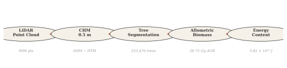
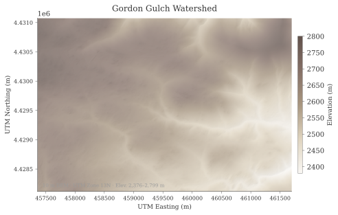
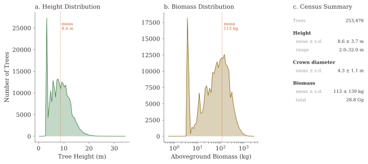
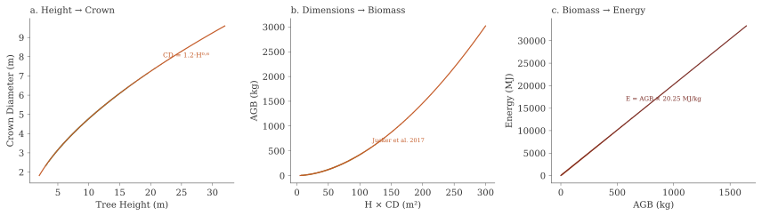
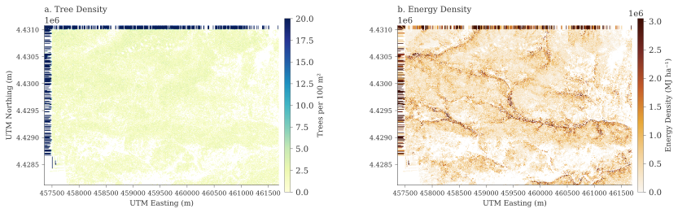

# Landscape Energetics — Figures

Figures from the Gordon Gulch watershed analysis. All data derived from USGS 3DEP DRCOG 2020 LiDAR (0.5 m resolution) and allometric biomass/energy conversion. Design follows Tufte principles: high data-ink ratio, direct labeling, minimal decoration.

---

## Analytical Workflow

<figure>
  
  <figcaption><strong>Figure 7.</strong> Sequential mass-energy transformation pipeline. Raw LiDAR returns (99 million points) are processed to a canopy height model, segmented into individual trees, converted to biomass via allometric equations, and scaled to energy content via higher heating values.</figcaption>
</figure>

---

## Study Area

<figure>
  
  <figcaption><strong>Figure 1.</strong> Gordon Gulch watershed, Arapahoe and Roosevelt National Forest, CO. Elevation ranges from 2,376 to 2,799 m across the 2.6 km² study area. 10 m DEM with analytical hillshade (azimuth 315°, altitude 45°).</figcaption>
</figure>

---

## Canopy Height Model

<figure>
  
  <figcaption><strong>Figure 2.</strong> Canopy Height Model at 0.5 m resolution, derived from 3DEP DRCOG 2020 LiDAR. CHM = DSM (maximum return) minus DTM (mean ground return), with 3×3 pit filling applied to both surfaces. Maximum canopy height is 32.5 m; 53% of the landscape has canopy exceeding 2 m.</figcaption>
</figure>

---

## Tree Census

<figure>
  
  <figcaption><strong>Figure 3.</strong> Structural dimensions of 253,476 segmented trees. <strong>(a)</strong> Height distribution showing modal height near 8 m with a right tail to 32 m. <strong>(b)</strong> Aboveground biomass on a log scale, reflecting the power-law allometric relationship. <strong>(c)</strong> Census summary statistics.</figcaption>
</figure>

---

## Individual Tree Detection

<figure>
  
  <figcaption><strong>Figure 8.</strong> Detail view (200 × 200 m) of individual tree detections overlaid on the CHM. Circles mark detected tree tops, sized proportionally to tree height. The variable-window local maxima algorithm adapts search radius to expected crown size at each height class.</figcaption>
</figure>

---

## Allometric Transformations

<figure>
  
  <figcaption><strong>Figure 5.</strong> Sequential scalar transformations from tree dimensions to energy content. <strong>(a)</strong> Height–crown diameter allometry (CD = 1.2·H<sup>0.6</sup>). <strong>(b)</strong> Dimensional product to biomass via the Jucker et al. (2017) gymnosperm model. <strong>(c)</strong> Linear biomass-to-energy conversion at 20.25 MJ kg<sup>−1</sup> (mean HHV for <em>Pinus</em> spp.).</figcaption>
</figure>

---

## Landscape Energy Field

<figure>
  
  <figcaption><strong>Figure 4.</strong> Landscape energy field showing the energy content (MJ) of each segmented tree. The spatial pattern reflects both tree density and size structure, with higher energy concentrations in mature forest stands on north-facing slopes. Total landscape energy: 5.82 × 10<sup>14</sup> J across 2.6 km².</figcaption>
</figure>

---

## Density Maps

<figure>
  
  <figcaption><strong>Figure 6.</strong> Spatial density distributions aggregated to 10 m grid cells. <strong>(a)</strong> Tree density (trees per 100 m²) reveals forest structure patterns including openings and dense stands. <strong>(b)</strong> Energy density (MJ ha<sup>−1</sup>) integrates both tree count and individual tree size, showing how landscape energy storage varies with topographic position.</figcaption>
</figure>

---

## Data Availability

All data products are archived on the [CyVerse Data Store](https://de.cyverse.org):

```
/iplant/home/tswetnam/eemt/
├── gordongulch_dem_10m_pitremoved.tif
├── gordongulch_chm_05m.tif
├── gordongulch_dsm_05m.tif
├── gordongulch_dtm_05m.tif
├── gordongulch_tree_census_05m.csv
├── gordongulch_tree_tops_05m.tif
└── gordongulch_energy_mj_05m.tif
```

The analysis notebook is available at [`notebooks/energetics.ipynb`](https://github.com/tyson-swetnam/eemt/blob/master/notebooks/energetics.ipynb).
