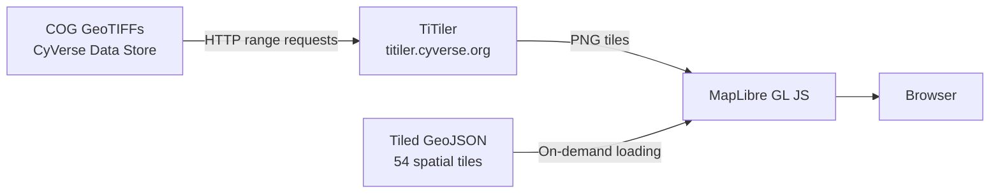

# Interactive Energy Map

Explore the Gordon Gulch landscape energetics dataset interactively. The map displays 253,476 individually segmented trees with their energy content, overlaid on Cloud Optimized GeoTIFF (COG) raster layers served via [TiTiler](https://titiler.cyverse.org).

<div style="position: relative; width: 100%; height: 0; padding-bottom: 75%; margin: 1em 0;">
  <iframe
    src="energetics-map.html"
    style="position: absolute; top: 0; left: 0; width: 100%; height: 100%; border: 1px solid #ddd;"
    loading="lazy"
    allowfullscreen>
  </iframe>
</div>

<a href="energetics-map.html" target="_blank" style="font-size: 0.9em;">Open full-screen map</a>

## Map Layers

| Layer | Source | Description |
|-------|--------|-------------|
| **Canopy Height** | `gordongulch_chm_05m_cog.tif` | 0.5 m CHM from 3DEP DRCOG 2020 LiDAR |
| **Elevation (DEM)** | `gordongulch_dem_10m_3dep_cog.tif` | 10 m pit-removed DEM |
| **Energy Density** | `gordongulch_energy_mj_05m_cog.tif` | Per-tree energy content raster |
| **Tree Stems** | `tiles/*.geojson` | 253,476 segmented trees (54 spatial tiles) |

## Architecture



- **Raster layers** are served as Cloud Optimized GeoTIFFs (COGs) via TiTiler, which performs on-the-fly reprojection and colormap rendering using HTTP range requests — no tile pre-generation needed.
- **Vector data** (tree stems) is split into 54 spatial tiles (~500 m grid) loaded on demand as the user pans. This avoids loading the full 50 MB GeoJSON at once.
- All data is publicly readable from the CyVerse Data Store at `/iplant/home/tswetnam/eemt/`.

## Data URLs

All COGs and GeoJSON are accessible via WebDAV:

```
https://data.cyverse.org/dav-anon/iplant/home/tswetnam/eemt/gordongulch_chm_05m_cog.tif
https://data.cyverse.org/dav-anon/iplant/home/tswetnam/eemt/gordongulch_dem_10m_3dep_cog.tif
https://data.cyverse.org/dav-anon/iplant/home/tswetnam/eemt/gordongulch_energy_mj_05m_cog.tif
https://data.cyverse.org/dav-anon/iplant/home/tswetnam/eemt/tiles/tile_index.json
```

TiTiler tile endpoints follow this pattern:

```
https://titiler.cyverse.org/cog/tiles/WebMercatorQuad/{z}/{x}/{y}.png
  ?url=https://data.cyverse.org/dav-anon/iplant/home/tswetnam/eemt/gordongulch_chm_05m_cog.tif
  &colormap_name=ylgn
  &rescale=0,30
```
