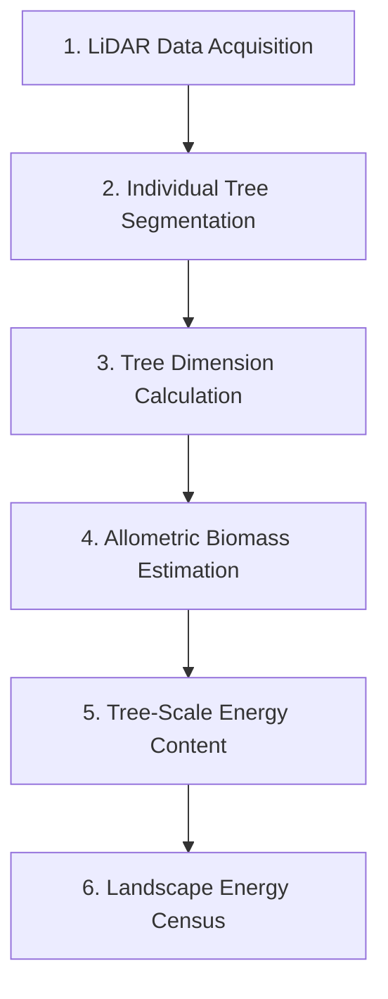

# Landscape Energetics from LiDAR-Derived Tree Census

## Overview

This chapter describes a workflow for estimating landscape-scale energy content from airborne LiDAR data. The approach applies sequential scalar mass-energy transformations at the individual tree scale: from point cloud to segmented trees, from tree dimensions to biomass, and from biomass to energy content.

The complete analytical workflow is implemented in the companion notebook: [`notebooks/energetics.ipynb`](../notebooks/energetics.ipynb).

## Study Area

Gordon Gulch (GG) watershed is located northwest of Denver, CO in the Arapahoe and Roosevelt National Forest. Gordon Gulch is part of the [Critical Zone Collaborative Network](https://criticalzone.org/) (CZNet), formerly the Critical Zone Observatories (CZO; Lin et al. 2011).

**Site characteristics:**

| Parameter | Value |
|-----------|-------|
| Area | 2.6 km² |
| Elevation range | 2,446 -- 2,737 m |
| Climate | Dry continental |
| Mean annual temperature | 5.1 °C |
| Mean annual precipitation | 52 cm |
| Dominant vegetation | *Pinus ponderosa* |

The relatively uniform coniferous forest cover, dominated by *Pinus ponderosa*, facilitated allometric analysis by reducing the need for multi-species identification in the LiDAR point cloud.

## Analytical Approach

We employed a sequence of data acquisitions and analytics to obtain landscape energy content, applying a series of scalar mass-energy transformations and sequential dimensional equivalents at the individual tree scale:

### Step 1: LiDAR Data Acquisition and Processing

LiDAR coverage of the study area was obtained from the [USGS 3DEP LiDAR portal](https://usgs.entwine.io/).

### Step 2: Individual Tree Segmentation

The landscape LiDAR point cloud was processed into individual tree segments following the methods of Swetnam and Falk (2014). Each tree was assigned a unique numerical identifier and geolocated with UTM easting and northing coordinates.

### Step 3: Calculation of Tree Dimensions

For each segmented tree, the following structural variables were calculated:

- **Tree height** (m) -- estimated from the LiDAR point cloud as the maximum point return elevation minus the ground surface elevation
- **Crown depth** (m) -- estimated as the difference between the maximum and minimum point return elevations for each segmented tree
- **Crown diameter** (m) -- estimated from the horizontal extent of the segmented point cloud
- **Diameter at breast height (DBH)** (cm) -- derived from allometric relationships with tree height

### Step 4: Calculating Biomass from Tree-Scale LiDAR Data

Aboveground biomass (AGB) was derived from tree height and canopy diameter following Jucker et al. (2017). This method calculates AGB directly from LiDAR measurements of maximum tree height and crown diameter, both of which are outputs of the segmentation algorithm.

The model is specified as:

$$\log(\text{AGB}) = \alpha + \beta \cdot \log(H \times CD) + \varepsilon$$

where:

- $\text{AGB}$ = aboveground biomass (kg)
- $H$ = canopy height (m)
- $CD$ = canopy diameter (m)
- $\alpha$, $\beta$ = regression coefficients

With coefficient values derived for gymnosperms (the dominant lifeform at our site), the prediction equation back-transformed exponentially with bias correction (Snowdon 1991) is:

$$\text{AGB} = 0.109 \times (H \times CD)^{1.79} \times 1.02$$

where:

- $\alpha = 0.109$ (intercept)
- $\beta = 1.79$ (scaling exponent)
- $1.02$ = bias correction factor for back-transformation

### Step 5: Estimating Tree-Scale Energy Content

The energy content of biomass was estimated using the **higher heating value (HHV)** metric, defined as the heat released when burning a gram of fuel in a calorimeter (closed container) at high temperature (~950 °C) to obtain complete combustion. Units are standardized to MJ/kg.

Literature values for whole-tree energy content were compiled from multiple *Pinus* species:

| Species | HHV (MJ/kg) | Source |
|---------|-------------|--------|
| *P. ponderosa* | -- | (to be populated) |
| *P. contorta* | -- | (to be populated) |
| *P. monticola* | -- | (to be populated) |
| *P. sylvestris* | -- | (to be populated) |
| *P. taeda* | -- | (to be populated) |

We used nine estimates from five species in the genus *Pinus*, returning an average energy content:

$$\Delta H_R = 20.25 \pm 0.67 \text{ MJ/kg}$$

This value is consistent with the global mean for temperate conifers ($20.34 \pm 0.86$ MJ/kg from 23 estimates across 15 species), suggesting that energy content per unit biomass is a conserved trait in this group.

For each tree $i$, energy content was calculated as:

$$E_i \text{ (MJ)} = \text{AGB}_i \text{ (kg)} \times \Delta H_R \text{ (MJ kg}^{-1}\text{)}$$

### Step 6: Landscape Energy Census

Total landscape aboveground energy content was estimated as the sum across all segmented trees:

$$E_{\text{total}} = \sum_{i=1}^{n} E_i$$

Energy density was then calculated per unit area for spatial comparison.

## Data Sources

### DEM

- **Source**: CyVerse Data Store (`/iplant/home/tswetnam/old_backups/swetnam_etal_2017/Boulder_Creek/Gordon/gordongulch_dem_10m_pitremoved.tif`)
- **Resolution**: 10 m, UTM Zone 13N
- **Elevation range**: 2,376 -- 2,800 m

### LiDAR Point Cloud

- **Source**: USGS 3DEP, CO DRCOG 2020 collection (`CO_DRCOG_2020_B20`)
- **Tiles**: 6 tiles covering the study area (818 MB LAZ)
- **Total points**: 99 million (clipped to DEM extent)
- **Ground-classified points**: 29.5 million

### Canopy Height Model

A 0.5 m resolution CHM was derived by differencing the Digital Surface Model (maximum LiDAR return) and Digital Terrain Model (mean ground-classified returns). NaN gaps were filled using nearest-neighbor interpolation, followed by a 3x3 mean filter applied to both DSM and DTM for pit filling (only cells lower than the filtered value are replaced).

- **Resolution**: 0.5 m (8,680 x 5,920 = 51.4M cells)
- **CHM range**: 0 -- 32.5 m
- **Canopy coverage** (>2 m): 53.0%
- **Mean canopy height** (>2 m): 7.3 m

## Results

### Tree Segmentation

The variable-window local maxima segmentation procedure identified **253,476 individual trees** across the 2.6 km² study area. Window sizes are specified in pixels (doubled relative to metric sizes to account for 0.5 m resolution). Each tree was assigned a unique identifier with UTM coordinates.

| Metric | Value |
|--------|-------|
| Trees detected | 253,476 |
| Height range | 2.0 -- 32.0 m |
| Mean height | 8.6 ± 3.7 m |
| Mean crown diameter | 4.3 ± 1.1 m |

### Allometric Conversions

| Metric | Value |
|--------|-------|
| Mean AGB per tree | 113.4 ± 138.9 kg |
| Total AGB | 28,754 Mg (28.75 Gg) |

### Landscape Energy Content

| Metric | Value |
|--------|-------|
| Total landscape energy | $5.82 \times 10^{14}$ J ($5.82 \times 10^{8}$ MJ) |
| Energy per km² | $2.24 \times 10^{14}$ J km⁻² |
| Energy per hectare | $2.24 \times 10^{12}$ J ha⁻¹ |
| Mean energy per tree | 2,297 MJ |
| Number of trees | 253,476 |
| Study area | 2.6 km² |

## Data Availability

All data products are archived on the [CyVerse Data Store](https://de.cyverse.org) at `/iplant/home/tswetnam/eemt/`:

| File | Description |
|------|-------------|
| `gordongulch_dem_10m_pitremoved.tif` | 10 m DEM (pit-removed) |
| `gordongulch_chm_05m.tif` | 0.5 m Canopy Height Model |
| `gordongulch_dsm_05m.tif` | 0.5 m Digital Surface Model |
| `gordongulch_dtm_05m.tif` | 0.5 m Digital Terrain Model |
| `gordongulch_tree_census_05m.csv` | Tree census (253,476 records) |
| `gordongulch_tree_tops_05m.tif` | Tree top locations raster |
| `gordongulch_energy_mj_05m.tif` | Per-tree energy raster |

See [Energetics Figures](energetics-figures.md) for publication-quality visualizations.

## References

- Jucker, T., et al. (2017). Allometric equations for integrating remote sensing imagery into forest monitoring programmes. *Global Change Biology*, 23(1), 177--190.
- Lin, H., et al. (2011). Earth's Critical Zone and hydropedology: concepts, characteristics, and advances. *Hydrology and Earth System Sciences*, 15(12), 3895--3910.
- Snowdon, P. (1991). A ratio estimator for bias correction in logarithmic regressions. *Canadian Journal of Forest Research*, 21(5), 720--724.
- Swetnam, T.L. and Falk, D.A. (2014). Application of metabolic scaling theory to reduce error in local maxima tree segmentation from aerial LiDAR. *Forest Ecology and Management*, 323, 158--167.
