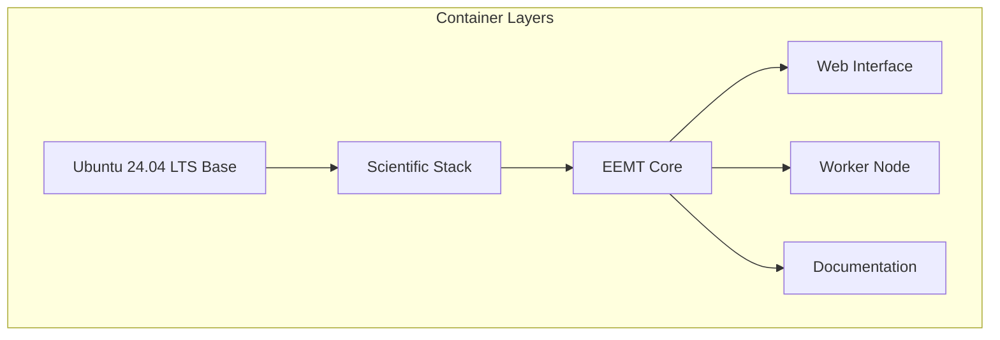
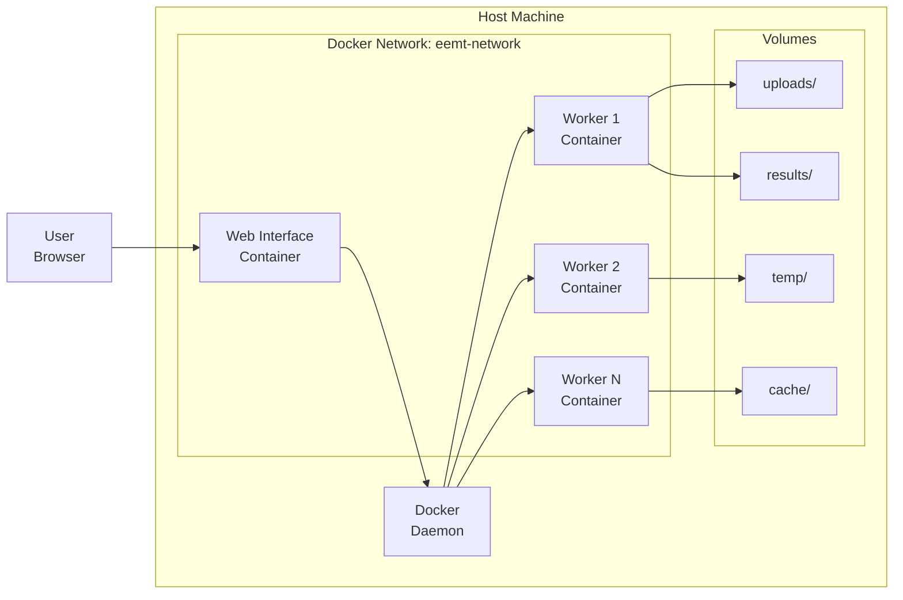
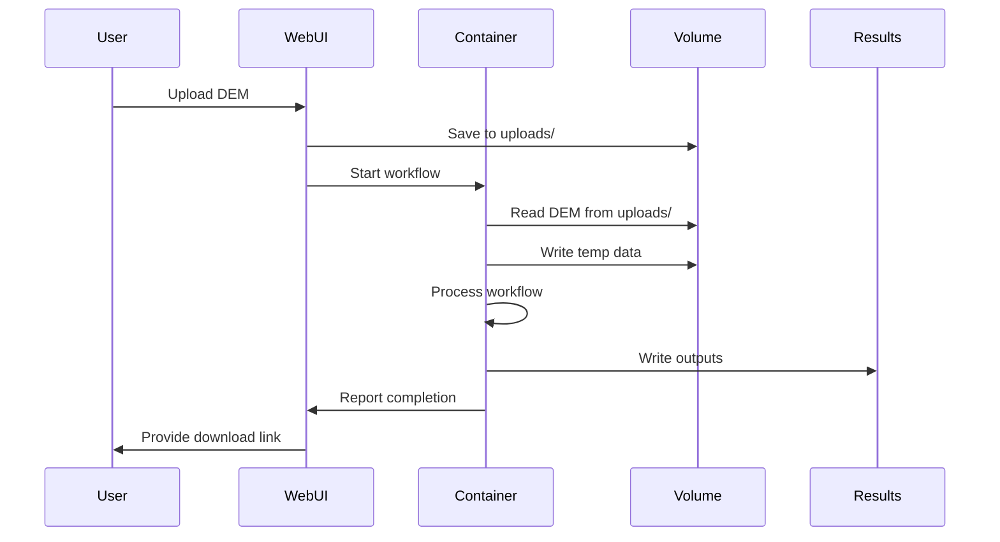

# Container Architecture

## Overview

The EEMT system utilizes a multi-layered container architecture designed for scalability, reproducibility, and ease of deployment. This document provides a comprehensive overview of the container ecosystem, including design decisions, component interactions, and deployment patterns.

## Architecture Design Principles

### Layered Container Strategy

The EEMT container architecture follows a layered approach with clear separation of concerns:

1. **Base Layer**: Ubuntu 24.04 LTS with system dependencies
2. **Scientific Stack Layer**: GDAL, GRASS GIS, geospatial libraries
3. **EEMT Core Layer**: Workflow scripts and scientific algorithms
4. **Application Layer**: Web interface, API, orchestration tools



### Container Images

#### Base Container: `eemt:ubuntu24.04`

**Purpose**: Core computational environment with all scientific dependencies

**Key Components**:
- Ubuntu 24.04 LTS base operating system
- Python 3.12 with Miniconda environment management
- GDAL 3.11+ with complete geospatial stack
- GRASS GIS 8.4+ compiled with EEMT extensions
- CCTools 7.8.2 (Makeflow + Work Queue)
- Scientific Python libraries (numpy, pandas, xarray, rasterio)

**Build Process**:
```bash
cd docker/ubuntu/24.04/
./build.sh
# Or manually:
docker build -t eemt:ubuntu24.04 .
```

**Size**: ~3.5 GB
**Base Image**: `ubuntu:24.04`

#### Web Interface Container: `eemt-web`

**Purpose**: FastAPI application for job submission and monitoring

**Key Components**:
- Inherits from `eemt:ubuntu24.04`
- FastAPI web framework
- SQLite job database
- Docker SDK for container management
- Workflow orchestration logic

**Build Process**:
```bash
docker build -t eemt-web -f docker/web-interface/Dockerfile .
```

**Size**: ~3.8 GB (includes base)
**Exposed Ports**: 5000 (web), 9123 (work queue)

#### Documentation Container: `eemt-docs`

**Purpose**: MkDocs documentation server

**Key Components**:
- Python 3.11 slim base
- MkDocs Material theme
- Documentation plugins
- Live reload capability

**Build Process**:
```bash
docker build -t eemt-docs -f docker/docs/Dockerfile .
```

**Size**: ~200 MB
**Exposed Port**: 8000

## Container Orchestration

### Docker Compose Architecture

The `docker-compose.yml` defines three deployment profiles:

```yaml
# Default Profile: Local single-node deployment
services:
  eemt-web:
    profiles: [default]
    ports: ["5000:5000"]
    volumes:
      - ./data:/app/data
      - /var/run/docker.sock:/var/run/docker.sock

# Distributed Profile: Multi-node cluster
  eemt-master:
    profiles: [distributed]
    ports: ["5000:5000", "9123:9123"]
    
  eemt-worker:
    profiles: [distributed]
    deploy:
      replicas: 5

# Documentation Profile
  eemt-docs:
    profiles: [docs]
    ports: ["8000:8000"]
```

### Container Communication



## Volume Management

### Data Persistence Strategy

The container architecture uses Docker volumes for data persistence with specific mount points:

| Volume | Container Path | Purpose | Persistence |
|--------|---------------|---------|-------------|
| `uploads` | `/app/uploads` | DEM file uploads | Persistent |
| `results` | `/app/results` | Workflow outputs | Persistent |
| `temp` | `/app/temp` | Processing scratch space | Ephemeral |
| `cache` | `/app/cache` | Workflow caching | Semi-persistent |
| `shared` | `/app/shared` | Distributed mode shared data | Persistent |

### Volume Configuration

```yaml
# Docker Compose volume definitions
volumes:
  eemt-data:
    driver: local
    driver_opts:
      type: none
      o: bind
      device: /data/eemt  # Host directory

# Container mount configuration
volumes:
  - type: bind
    source: ./data/uploads
    target: /app/uploads
    read_only: false
  - type: bind
    source: ./data/results
    target: /app/results
    read_only: false
  - type: tmpfs
    target: /tmp
    tmpfs:
      size: 2G
```

### Data Flow Architecture



## Network Configuration

### Bridge Network

The default `eemt-network` uses Docker's bridge driver:

```yaml
networks:
  eemt-network:
    driver: bridge
    ipam:
      config:
        - subnet: 172.28.0.0/16
          gateway: 172.28.0.1
```

### Service Discovery

Containers use Docker's internal DNS for service discovery:

- Web interface: `eemt-web` or `eemt-master`
- Workers: `eemt-worker`, `eemt-worker-2`, etc.
- Documentation: `eemt-docs`

### Port Exposure

| Service | Internal Port | External Port | Protocol | Purpose |
|---------|--------------|---------------|----------|---------|
| Web Interface | 5000 | 5000 | HTTP | FastAPI application |
| Work Queue | 9123 | 9123 | TCP | CCTools master |
| Documentation | 8000 | 8000 | HTTP | MkDocs server |
| Monitoring | 9090 | 9090 | HTTP | Prometheus (future) |

## Container Lifecycle Management

### Startup Sequence

1. **Network Creation**: Docker creates `eemt-network`
2. **Volume Initialization**: Bind mounts are established
3. **Base Services**: Database, cache services start
4. **Web Interface**: FastAPI application initializes
5. **Workers**: Worker containers connect to master
6. **Health Checks**: Containers report ready status

### Health Monitoring

```dockerfile
# Health check configuration
HEALTHCHECK --interval=30s --timeout=10s --start-period=40s --retries=3 \
  CMD curl -f http://localhost:5000/health || exit 1
```

### Resource Limits

```yaml
# Container resource constraints
deploy:
  resources:
    limits:
      cpus: '4'
      memory: 8G
    reservations:
      cpus: '2'
      memory: 4G
```

## Security Considerations

### Container Security

1. **Non-root Execution**: Containers run as user `eemt` (UID 1000)
2. **Minimal Base Images**: Only essential packages installed
3. **Read-only Root Filesystem**: Where applicable
4. **Secrets Management**: Environment variables for sensitive data

```dockerfile
# Security configuration in Dockerfile
RUN useradd -m -s /bin/bash -u 1000 eemt
USER eemt
WORKDIR /home/eemt
```

### Network Security

```yaml
# Network isolation configuration
networks:
  frontend:
    internal: false
  backend:
    internal: true
```

### Volume Security

- Read-only mounts for input data
- Restricted permissions on result directories
- Temporary data cleaned after processing

## Performance Optimization

### Build Optimization

```dockerfile
# Multi-stage build for smaller images
FROM ubuntu:24.04 as builder
RUN apt-get update && apt-get install -y build-essential
# Build steps...

FROM ubuntu:24.04
COPY --from=builder /app /app
```

### Layer Caching

```bash
# Leverage build cache
docker build --cache-from eemt:ubuntu24.04 -t eemt:ubuntu24.04 .
```

### Runtime Optimization

- Shared memory for inter-process communication
- Volume caching for frequently accessed data
- CPU affinity for computational tasks

## Troubleshooting

### Common Issues

#### Container Fails to Start

```bash
# Check logs
docker logs eemt-web

# Inspect container
docker inspect eemt-web

# Debug interactively
docker run -it --entrypoint /bin/bash eemt-web
```

#### Volume Permission Issues

```bash
# Fix ownership
docker exec eemt-web chown -R eemt:eemt /app/data

# Check permissions
docker exec eemt-web ls -la /app/data
```

#### Network Connectivity

```bash
# Test internal DNS
docker exec eemt-worker ping eemt-master

# Check network configuration
docker network inspect eemt-network
```

### Debugging Tools

```bash
# Container shell access
docker exec -it eemt-web /bin/bash

# Process monitoring
docker top eemt-worker

# Resource usage
docker stats --no-stream

# Network debugging
docker run --rm --network eemt-network nicolaka/netshoot
```

## Best Practices

### Image Management

1. **Version Tags**: Always use specific version tags
2. **Regular Updates**: Rebuild images monthly for security patches
3. **Image Scanning**: Use `docker scan` for vulnerability detection
4. **Registry Usage**: Push to registry for distributed deployments

### Container Operations

1. **Graceful Shutdown**: Implement SIGTERM handlers
2. **Log Management**: Use centralized logging
3. **Monitoring**: Implement health checks and metrics
4. **Backup Strategy**: Regular volume backups

### Development Workflow

1. **Local Development**: Use bind mounts for code changes
2. **Testing**: Separate test containers with isolated data
3. **Staging**: Mirror production configuration
4. **CI/CD Integration**: Automated builds and deployments

## Migration and Upgrades

### Container Image Updates

```bash
# Pull latest images
docker pull eemt:ubuntu24.04:latest

# Stop running containers
docker-compose down

# Update and restart
docker-compose up -d
```

### Data Migration

```bash
# Backup volumes
docker run --rm -v eemt_data:/data -v $(pwd):/backup \
  ubuntu tar czf /backup/eemt-backup.tar.gz /data

# Restore volumes
docker run --rm -v eemt_data:/data -v $(pwd):/backup \
  ubuntu tar xzf /backup/eemt-backup.tar.gz -C /
```

## Future Enhancements

### Planned Improvements

1. **Kubernetes Support**: Helm charts for K8s deployment
2. **GPU Acceleration**: CUDA-enabled containers
3. **Service Mesh**: Istio/Linkerd integration
4. **Observability**: Prometheus + Grafana stack
5. **Registry Integration**: Harbor/Nexus private registry

### Container Roadmap

- Q1 2025: GPU-accelerated GRASS GIS container
- Q2 2025: Kubernetes operators for EEMT
- Q3 2025: Multi-architecture images (ARM64)
- Q4 2025: Serverless container deployments

## Related Documentation

- [Docker Deployment Guide](../getting-started/docker-deployment.md)
- [Distributed Deployment](../distributed-deployment/index.md)
- [Web Interface Architecture](../web-interface/architecture.md)
- [Development Guide](../development/containers.md)