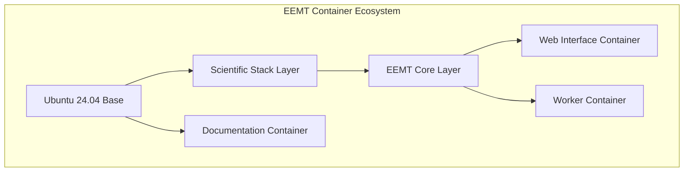
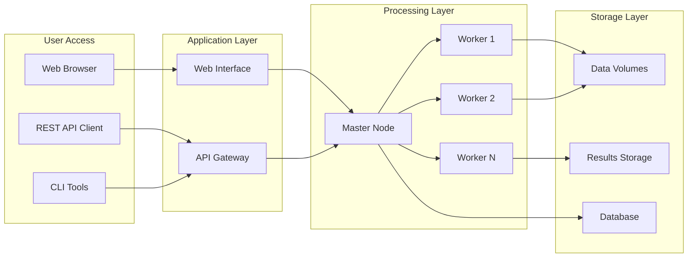
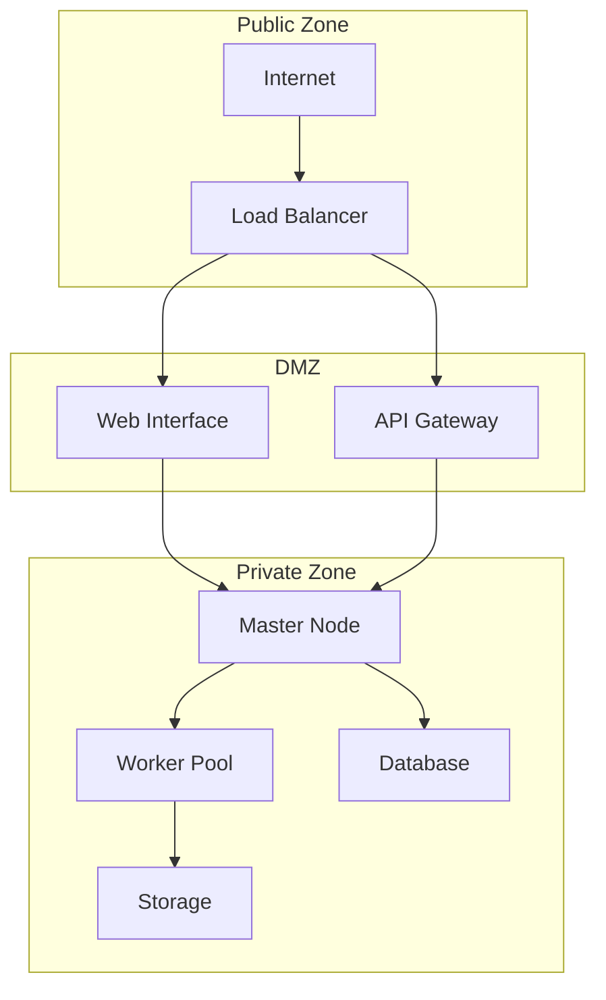

# Infrastructure Documentation

## Overview

The EEMT infrastructure documentation provides comprehensive technical details about the system architecture, deployment configurations, and operational considerations for running EEMT at scale.

## Documentation Sections

### [Container Architecture](./container-architecture.md)
Detailed documentation of the Docker container ecosystem including:
- Multi-layered container design
- Image composition and dependencies
- Volume management strategies
- Network configuration
- Security considerations
- Performance optimization

### [Docker Deployment Guide](../getting-started/docker-deployment.md)
Step-by-step instructions for deploying EEMT using Docker:
- Prerequisites and installation
- Quick start procedures
- Deployment modes (local, distributed, documentation)
- Configuration options
- Monitoring and maintenance

### [Web Interface Architecture](../web-interface/architecture.md)
Technical architecture of the FastAPI web application:
- System design and components
- Request handling flow
- Database architecture
- Frontend implementation
- Container orchestration
- Performance considerations

### [Distributed Deployment](../distributed-deployment/index.md)
Guide for scaling EEMT across multiple nodes:
- Master-worker architecture
- HPC integration examples
- Container orchestration platforms
- Network and storage configuration

## Infrastructure Components

### Container Stack



### Key Technologies

| Component | Technology | Version | Purpose |
|-----------|------------|---------|---------|
| **Base OS** | Ubuntu | 24.04 LTS | Container operating system |
| **Container Runtime** | Docker | 20.10+ | Container execution |
| **Orchestration** | Docker Compose | v2.0+ | Multi-container management |
| **Web Framework** | FastAPI | 0.100+ | REST API and web interface |
| **Workflow Engine** | CCTools | 7.8.2 | Distributed task execution |
| **GIS Engine** | GRASS GIS | 8.4+ | Geospatial processing |
| **Database** | SQLite | 3.x | Job tracking and persistence |

### Deployment Architecture



## Resource Requirements

### Minimum Infrastructure

| Resource | Minimum | Recommended | Notes |
|----------|---------|-------------|-------|
| **CPU** | 4 cores | 8+ cores | More cores enable parallel processing |
| **RAM** | 8 GB | 16+ GB | 2GB per worker thread |
| **Storage** | 50 GB | 200+ GB | Depends on dataset size |
| **Network** | 10 Mbps | 100+ Mbps | For climate data downloads |
| **Docker** | 20.10 | Latest stable | Required for container execution |

### Scaling Considerations

#### Vertical Scaling (Single Node)
- Increase CPU cores for more parallel workers
- Add RAM for larger datasets
- Use SSD storage for improved I/O
- GPU acceleration (future enhancement)

#### Horizontal Scaling (Multi-Node)
- Deploy master node for coordination
- Add worker nodes for processing
- Use shared storage (NFS, S3)
- Implement load balancing

## Network Architecture

### Port Allocations

| Service | Port | Protocol | Purpose |
|---------|------|----------|---------|
| Web Interface | 5000 | HTTP | Browser access |
| Work Queue | 9123 | TCP | Master-worker communication |
| Documentation | 8000 | HTTP | MkDocs server |
| Monitoring | 9090 | HTTP | Prometheus (future) |
| Database | 5432 | TCP | PostgreSQL (future) |

### Security Zones



## Storage Architecture

### Volume Types

| Volume | Type | Persistence | Purpose |
|--------|------|-------------|---------|
| uploads | Bind mount | Persistent | DEM file uploads |
| results | Bind mount | Persistent | Workflow outputs |
| temp | tmpfs | Ephemeral | Processing scratch |
| cache | Bind mount | Semi-persistent | Workflow caching |
| shared | NFS/S3 | Persistent | Distributed storage |

### Data Flow

1. **Input Stage**: DEM files uploaded to `uploads/` volume
2. **Processing Stage**: Temporary data in `temp/` volume
3. **Output Stage**: Results written to `results/` volume
4. **Archive Stage**: Results compressed and stored

## Monitoring and Observability

### Health Checks

```yaml
# Docker health check configuration
healthcheck:
  test: ["CMD", "curl", "-f", "http://localhost:5000/health"]
  interval: 30s
  timeout: 10s
  retries: 3
  start_period: 40s
```

### Metrics Collection

- **System Metrics**: CPU, memory, disk, network
- **Application Metrics**: Job count, processing time, success rate
- **Container Metrics**: Resource usage, restart count
- **Custom Metrics**: EEMT-specific calculations

### Logging Strategy

| Component | Log Location | Retention | Level |
|-----------|-------------|-----------|-------|
| Web Interface | `/app/logs/` | 7 days | INFO |
| Workers | Container stdout | 24 hours | INFO |
| System | `/var/log/` | 30 days | WARNING |
| Audit | Database | 90 days | ALL |

## Disaster Recovery

### Backup Strategy

1. **Database Backups**: Daily SQLite dumps
2. **Volume Snapshots**: Weekly filesystem snapshots
3. **Configuration Backup**: Version controlled in Git
4. **Container Images**: Registry backups

### Recovery Procedures

1. **Service Failure**: Auto-restart via Docker
2. **Node Failure**: Failover to standby node
3. **Data Loss**: Restore from backups
4. **Complete Disaster**: Rebuild from infrastructure-as-code

## Performance Tuning

### Container Optimization

```yaml
# Resource limits and reservations
deploy:
  resources:
    limits:
      cpus: '4.0'
      memory: 8G
    reservations:
      cpus: '2.0'
      memory: 4G
```

### Network Optimization

- Use bridge networks for local communication
- Enable host networking for performance-critical workers
- Implement connection pooling
- Configure DNS caching

### Storage Optimization

- Use SSD for temporary processing
- Enable compression for results
- Implement data deduplication
- Regular cleanup of temporary files

## Best Practices

### Deployment

1. Use infrastructure-as-code (Docker Compose, Kubernetes manifests)
2. Implement blue-green deployments
3. Maintain staging environments
4. Automate deployment pipelines

### Security

1. Run containers as non-root users
2. Implement network segmentation
3. Enable TLS for all communications
4. Regular security updates

### Operations

1. Monitor all critical metrics
2. Implement automated alerts
3. Maintain runbooks for common issues
4. Regular disaster recovery testing

## Troubleshooting Guide

### Common Issues

| Issue | Cause | Solution |
|-------|-------|----------|
| Container won't start | Missing image | Run `docker-compose build` |
| Out of memory | Resource limits | Increase memory allocation |
| Slow performance | I/O bottleneck | Use SSD storage |
| Network timeouts | Firewall rules | Check port accessibility |
| Job failures | Invalid parameters | Review parameter validation |

### Diagnostic Commands

```bash
# Check container status
docker ps -a

# View container logs
docker logs <container_name>

# Inspect container
docker inspect <container_name>

# Monitor resources
docker stats

# Network diagnostics
docker network ls
docker network inspect <network_name>

# Volume inspection
docker volume ls
docker volume inspect <volume_name>
```

## Future Enhancements

### Planned Infrastructure Improvements

1. **Kubernetes Migration**: Helm charts and operators
2. **Service Mesh**: Istio/Linkerd integration
3. **Observability Stack**: Prometheus + Grafana + Loki
4. **CI/CD Pipeline**: GitHub Actions + ArgoCD
5. **Multi-Cloud Support**: AWS, GCP, Azure deployments

### Roadmap

- **Q1 2025**: Kubernetes deployment support
- **Q2 2025**: Enhanced monitoring and alerting
- **Q3 2025**: Multi-region deployment
- **Q4 2025**: Serverless execution options

## Support Resources

- [GitHub Issues](https://github.com/cyverse-gis/eemt/issues)
- [Discussion Forum](https://github.com/cyverse-gis/eemt/discussions)
- [Container Registry](https://hub.docker.com/r/eemt/ubuntu24.04)
- [Documentation](https://tyson-swetnam.github.io/eemt/)