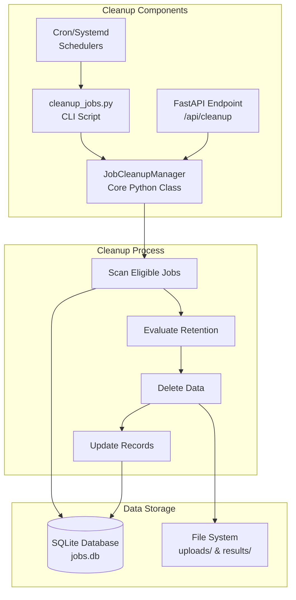

# Job Data Cleanup System

The EEMT infrastructure includes an automated job data cleanup system designed to manage disk space efficiently while preserving important job metadata for auditing and analysis.

## Overview

The cleanup system provides intelligent data lifecycle management with the following key features:

- **Automated retention policies** - Different policies for successful vs failed jobs
- **Selective data deletion** - Preserves job configurations while removing output data
- **Configurable scheduling** - Cron, systemd, or manual execution options
- **Container integration** - Works seamlessly with Docker and Kubernetes deployments
- **API endpoints** - RESTful interface for programmatic cleanup control

!!! tip "Quick Start"
    For most deployments, the default configuration works out of the box:
    ```bash
    # Install automated cleanup (runs daily at 2 AM)
    cd web-interface/
    ./setup_cleanup_cron.sh --user --method cron
    ```

## System Architecture



## Retention Policies

### Default Retention Rules

| Job Status | Data Component | Default Retention | Action After Retention |
|------------|---------------|-------------------|------------------------|
| **Successful** | Output data (`results/`) | 7 days | Delete files, preserve job record |
| **Successful** | Input DEM (`uploads/`) | 7 days | Delete file if exists |
| **Successful** | Job configuration | Forever | Preserved in database |
| **Successful** | Execution logs | 7 days | Delete with output data |
| **Failed** | All data | 12 hours | Complete deletion |
| **Failed** | Error information | Forever | Preserved in job record |
| **Running** | All data | N/A | Never auto-deleted |
| **Pending** | All data | N/A | Never auto-deleted |

### Rationale

The retention policies are designed based on typical usage patterns:

- **Successful jobs (7 days)**: Provides sufficient time for users to download results while managing disk space
- **Failed jobs (12 hours)**: Quick cleanup since failed job data is rarely needed after debugging
- **Configuration preservation**: Maintains audit trail and enables job re-execution if needed
- **Running/Pending protection**: Ensures active jobs are never interrupted

## Implementation Details

### Core Components

#### JobCleanupManager Class

The `JobCleanupManager` class in `cleanup_jobs.py` provides the core cleanup functionality:

```python
class JobCleanupManager:
    """Manages automated cleanup of EEMT job data"""
    
    def __init__(self, base_dir: Path, dry_run: bool = False):
        self.base_dir = base_dir
        self.dry_run = dry_run
        self.db_path = base_dir / "jobs.db"
        self.results_dir = base_dir / "results"
        self.uploads_dir = base_dir / "uploads"
        
        # Configurable retention periods
        self.success_retention_days = int(
            os.getenv('EEMT_SUCCESS_RETENTION_DAYS', '7')
        )
        self.failed_retention_hours = int(
            os.getenv('EEMT_FAILED_RETENTION_HOURS', '12')
        )
```

Key methods:

- `get_jobs_for_cleanup()`: Queries database for eligible jobs based on age and status
- `cleanup_job_data()`: Performs actual deletion of files and directories
- `run_cleanup()`: Orchestrates the complete cleanup process
- `_get_directory_size_mb()`: Calculates space to be freed

#### Database Schema

The cleanup system adds tracking fields to the jobs table:

```sql
-- Additional fields for cleanup tracking
ALTER TABLE jobs ADD COLUMN completed_at TIMESTAMP;
ALTER TABLE jobs ADD COLUMN data_cleaned_at TIMESTAMP;
ALTER TABLE jobs ADD COLUMN cleanup_summary TEXT;
```

#### File System Operations

The cleanup process handles various file types:

1. **Results directory** (`results/<job_id>/`):
   - Contains all workflow outputs (GeoTIFF files, logs, metadata)
   - Deleted recursively for eligible jobs
   - Size calculated before deletion for reporting

2. **Upload directory** (`uploads/<filename>`):
   - Contains original DEM files
   - Deleted if associated with cleaned job
   - Filename stored in job record for reference

3. **Temporary files** (`temp/<job_id>/`):
   - Working directories for active jobs
   - Cleaned immediately after job completion
   - Not subject to retention policies

### SQL Queries

The system uses optimized queries to identify cleanup candidates:

```sql
-- Find successful jobs older than retention period
SELECT id, workflow_type, status, completed_at, dem_filename, parameters
FROM jobs 
WHERE status = 'completed' 
  AND completed_at IS NOT NULL 
  AND datetime(completed_at) < datetime('now', '-7 days')
ORDER BY completed_at ASC;

-- Find failed jobs older than retention period
SELECT id, workflow_type, status, completed_at, dem_filename, parameters
FROM jobs 
WHERE status = 'failed' 
  AND completed_at IS NOT NULL 
  AND datetime(completed_at) < datetime('now', '-12 hours')
ORDER BY completed_at ASC;
```

## Configuration Options

### Environment Variables

Configure cleanup behavior through environment variables:

```bash
# Retention periods
export EEMT_SUCCESS_RETENTION_DAYS=7    # Days to keep successful job data
export EEMT_FAILED_RETENTION_HOURS=12   # Hours to keep failed job data

# Operational settings
export EEMT_DRY_RUN=true               # Preview mode without deletion
export EEMT_CLEANUP_LOG_LEVEL=INFO     # Logging verbosity
export EEMT_CLEANUP_BATCH_SIZE=100     # Jobs per cleanup batch

# Directory paths (if non-standard)
export EEMT_BASE_DIR=/path/to/web-interface
export EEMT_RESULTS_DIR=/path/to/results
export EEMT_UPLOADS_DIR=/path/to/uploads
```

### Command-Line Arguments

Override defaults via command-line:

```bash
python cleanup_jobs.py \
    --success-retention-days 14 \
    --failed-retention-hours 24 \
    --base-dir /custom/path \
    --dry-run \
    --verbose
```

### Configuration File (Advanced)

For complex deployments, use a YAML configuration:

```yaml
# cleanup_config.yaml
retention:
  successful_jobs:
    days: 7
    keep_metadata: true
    keep_logs: false
  failed_jobs:
    hours: 12
    keep_error_logs: true

performance:
  batch_size: 100
  parallel_delete: true
  max_workers: 4

notifications:
  enabled: true
  email_on_error: admin@example.com
  summary_webhook: https://hooks.slack.com/services/XXX
```

## Scheduling Options

### Cron Integration

The provided `setup_cleanup_cron.sh` script automates cron configuration:

```bash
# User-level cron (recommended)
./setup_cleanup_cron.sh --user --method cron

# System-wide cron (requires sudo)
sudo ./setup_cleanup_cron.sh --system --method cron
```

This creates a cron entry:
```cron
# Daily at 2:00 AM
0 2 * * * cd /path/to/web-interface && python3 cleanup_jobs.py >> cleanup_jobs.log 2>&1
```

### Systemd Timer

For systemd-based systems:

```bash
# Install systemd timer
./setup_cleanup_cron.sh --user --method systemd

# Check status
systemctl --user status eemt-cleanup.timer

# View logs
journalctl --user -u eemt-cleanup.service
```

### Manual Execution

Run cleanup on-demand:

```bash
# Production cleanup
python cleanup_jobs.py

# Preview mode (no deletion)
python cleanup_jobs.py --dry-run

# Verbose output
python cleanup_jobs.py --verbose
```

## API Integration

### RESTful Endpoint

The FastAPI application exposes a cleanup endpoint:

```python
@app.post("/api/cleanup")
async def trigger_cleanup(
    dry_run: bool = False,
    success_retention_days: int = 7,
    failed_retention_hours: int = 12
):
    """Trigger job data cleanup via API"""
    
    cleanup_manager = JobCleanupManager(
        base_dir=Path("./"),
        dry_run=dry_run
    )
    
    # Override retention if specified
    if success_retention_days:
        cleanup_manager.success_retention_days = success_retention_days
    if failed_retention_hours:
        cleanup_manager.failed_retention_hours = failed_retention_hours
    
    # Run cleanup
    summary = cleanup_manager.run_cleanup()
    
    return {
        "success": True,
        "summary": summary,
        "timestamp": datetime.now().isoformat()
    }
```

### API Usage Examples

```bash
# Trigger cleanup with defaults
curl -X POST http://localhost:5000/api/cleanup

# Dry run to preview
curl -X POST http://localhost:5000/api/cleanup?dry_run=true

# Custom retention periods
curl -X POST http://localhost:5000/api/cleanup \
  -H "Content-Type: application/json" \
  -d '{
    "success_retention_days": 3,
    "failed_retention_hours": 6
  }'
```

## Logging and Monitoring

### Log Output

The cleanup system provides detailed logging:

```
2024-01-20 02:00:01 INFO - Cleanup manager initialized:
2024-01-20 02:00:01 INFO -   Base directory: /home/user/eemt/web-interface
2024-01-20 02:00:01 INFO -   Success retention: 7 days
2024-01-20 02:00:01 INFO -   Failed retention: 12 hours
2024-01-20 02:00:01 INFO - Starting EEMT job data cleanup process
2024-01-20 02:00:02 INFO - Found 3 successful jobs for data cleanup
2024-01-20 02:00:02 INFO - Found 2 failed jobs for complete deletion
2024-01-20 02:00:03 INFO - Processing job job-20240113-123456 (completed, 2024-01-13 14:23:45)
2024-01-20 02:00:04 INFO - Deleted results directory: results/job-20240113-123456 (15234.5 MB)
2024-01-20 02:00:04 INFO - Deleted uploaded DEM: uploads/job-20240113-123456_dem.tif (250.3 MB)
2024-01-20 02:00:05 INFO - === CLEANUP SUMMARY ===
2024-01-20 02:00:05 INFO - Successful jobs processed: 3
2024-01-20 02:00:05 INFO - Failed jobs processed: 2
2024-01-20 02:00:05 INFO - Total disk space freed: 45678.9 MB
2024-01-20 02:00:05 INFO - Job configs preserved: 3
2024-01-20 02:00:05 INFO - Job configs deleted: 2
2024-01-20 02:00:05 INFO - Cleanup completed successfully
```

### Summary Reports

Each cleanup run generates a JSON summary:

```json
{
  "start_time": "2024-01-20T02:00:01.123456",
  "end_time": "2024-01-20T02:00:05.789012",
  "dry_run": false,
  "successful_jobs_processed": 3,
  "failed_jobs_processed": 2,
  "total_size_freed_mb": 45678.9,
  "configs_preserved": 3,
  "configs_deleted": 2,
  "errors": [],
  "job_details": [
    {
      "job_id": "job-20240113-123456",
      "status": "completed",
      "completed_at": "2024-01-13T14:23:45",
      "data_deleted": true,
      "config_preserved": true,
      "size_freed_mb": 15484.8,
      "files_deleted": ["uploads/job-20240113-123456_dem.tif"],
      "directories_deleted": ["results/job-20240113-123456"]
    }
  ]
}
```

### Monitoring Metrics

Track cleanup effectiveness:

```python
# Example monitoring query
SELECT 
    DATE(completed_at) as date,
    COUNT(*) as jobs_completed,
    COUNT(CASE WHEN data_cleaned_at IS NOT NULL THEN 1 END) as jobs_cleaned,
    SUM(CASE WHEN data_cleaned_at IS NOT NULL THEN 1 ELSE 0 END) * 100.0 / COUNT(*) as cleanup_rate
FROM jobs
WHERE completed_at >= date('now', '-30 days')
GROUP BY DATE(completed_at)
ORDER BY date DESC;
```

## Docker Integration

### Container Configuration

The cleanup system works seamlessly with Docker:

```yaml
# docker-compose.yml
services:
  eemt-web:
    image: eemt-web:latest
    environment:
      - EEMT_SUCCESS_RETENTION_DAYS=7
      - EEMT_FAILED_RETENTION_HOURS=12
      - EEMT_ENABLE_AUTO_CLEANUP=true
    volumes:
      - ./uploads:/app/uploads
      - ./results:/app/results
      - ./jobs.db:/app/jobs.db
    command: >
      sh -c "
      python app.py &
      while true; do
        sleep 86400
        python cleanup_jobs.py
      done
      "
```

### Container Execution

Run cleanup within containers:

```bash
# Execute in running container
docker exec eemt-web python cleanup_jobs.py

# Run in dedicated container
docker run --rm \
  -v $(pwd)/uploads:/app/uploads \
  -v $(pwd)/results:/app/results \
  -v $(pwd)/jobs.db:/app/jobs.db \
  eemt-web python cleanup_jobs.py --dry-run
```

## Security Considerations

### Access Control

The cleanup system implements several security measures:

1. **Path validation**: Ensures deletions only occur within designated directories
2. **Job ownership verification**: Confirms files belong to the job being cleaned
3. **Database integrity**: Uses transactions to prevent partial updates
4. **Audit logging**: Tracks all cleanup operations for accountability

### Safe Deletion

The cleanup process includes safeguards:

```python
def cleanup_job_data(self, job: Dict, keep_job_config: bool = True):
    """Clean up job data with safety checks"""
    
    # Validate job ID format
    if not re.match(r'^job-\d{8}-\d{6}$', job['id']):
        raise ValueError(f"Invalid job ID format: {job['id']}")
    
    # Verify paths are within allowed directories
    results_path = self.results_dir / job['id']
    if not str(results_path).startswith(str(self.results_dir)):
        raise ValueError(f"Results path outside allowed directory")
    
    # Perform deletion with error handling
    try:
        if results_path.exists():
            shutil.rmtree(results_path)
    except Exception as e:
        logger.error(f"Failed to delete {results_path}: {e}")
        raise
```

## Troubleshooting

### Common Issues

1. **Permission Denied**
   - Check file ownership: `ls -la uploads/ results/`
   - Fix permissions: `chmod -R 755 uploads/ results/`

2. **Database Locked**
   - Check for concurrent access: `fuser jobs.db`
   - Wait for operations to complete or restart services

3. **Disk Space Not Freed**
   - Verify deletion: `du -sh results/job-*`
   - Check for open file handles: `lsof | grep results`
   - Force filesystem sync: `sync`

4. **Cleanup Not Running**
   - Check cron: `crontab -l` and `grep CRON /var/log/syslog`
   - Check systemd: `systemctl --user status eemt-cleanup.timer`

### Debug Mode

Enable detailed debugging:

```bash
# Maximum verbosity
export EEMT_CLEANUP_LOG_LEVEL=DEBUG
python cleanup_jobs.py --verbose --dry-run

# Debug output includes:
# - SQL queries executed
# - Files and directories examined
# - Size calculations
# - Decision logic for each job
```

## Best Practices

1. **Test with dry-run first**: Always preview cleanup actions before production use
2. **Monitor disk usage**: Set up alerts for high disk usage
3. **Backup critical data**: Archive important results before retention period expires
4. **Regular monitoring**: Check cleanup logs and summaries weekly
5. **Adjust retention as needed**: Modify periods based on usage patterns
6. **Document changes**: Log any modifications to retention policies

## Summary

The EEMT job data cleanup system provides automated, configurable management of job data lifecycle. It balances disk space efficiency with data preservation needs, ensuring system performance while maintaining important job metadata for analysis and auditing. The flexible architecture supports various deployment scenarios from single-node installations to distributed container orchestrations.