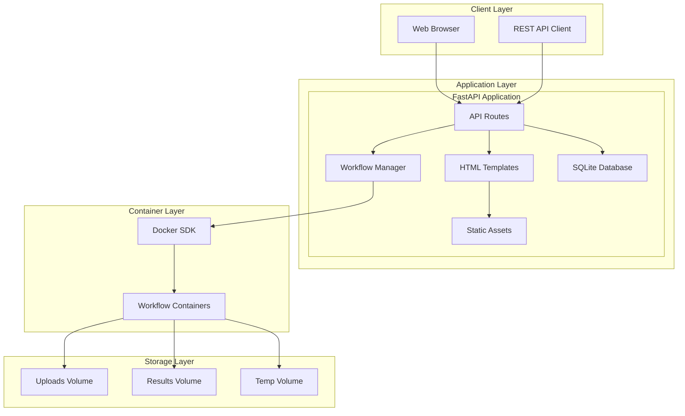
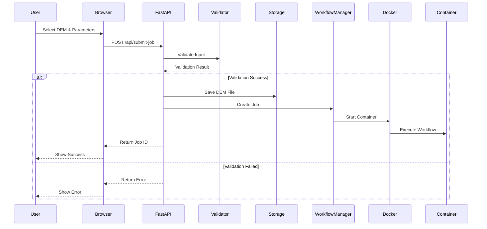
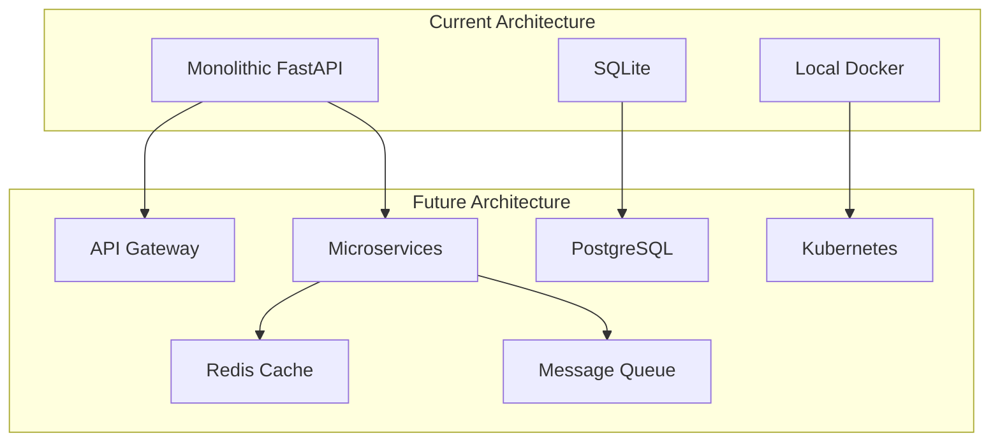

# Web Interface Architecture

## Overview

The EEMT Web Interface is a modern, containerized FastAPI application that provides browser-based access to EEMT workflows. This document details the architectural design, component interactions, and implementation patterns that power the web interface.

## System Architecture

### High-Level Design



### Component Overview

The web interface consists of several interconnected components:

1. **FastAPI Application**: Core web framework handling HTTP requests
2. **Workflow Manager**: Orchestrates container execution and job management
3. **Database Layer**: SQLite for job persistence and tracking
4. **Docker Integration**: Container lifecycle management
5. **Frontend**: HTML/JavaScript interface for user interaction
6. **Storage Management**: Volume handling for data persistence

## FastAPI Application Structure

### Directory Layout

```
web-interface/
├── app.py                 # Main FastAPI application
├── containers/
│   ├── __init__.py
│   └── workflow_manager.py # Container orchestration
├── models/
│   ├── __init__.py
│   └── job.py            # Pydantic models
├── templates/
│   ├── index.html        # Job submission page
│   ├── monitor.html      # Job monitoring dashboard
│   └── base.html         # Base template
├── static/
│   ├── css/
│   │   └── style.css
│   ├── js/
│   │   ├── main.js
│   │   └── monitor.js
│   └── img/
├── uploads/              # DEM file uploads
├── results/              # Job outputs
├── temp/                 # Temporary processing
├── cache/                # Workflow cache
├── jobs.db               # SQLite database
└── requirements.txt      # Python dependencies
```

### Application Initialization

```python
# app.py core structure
from fastapi import FastAPI, BackgroundTasks
from fastapi.staticfiles import StaticFiles
from fastapi.templating import Jinja2Templates
import sqlite3

app = FastAPI(
    title="EEMT Web Interface",
    description="Effective Energy and Mass Transfer Workflow System",
    version="2.0.0"
)

# Mount static files
app.mount("/static", StaticFiles(directory="static"), name="static")

# Configure templates
templates = Jinja2Templates(directory="templates")

# Initialize database
def init_db():
    conn = sqlite3.connect('jobs.db')
    cursor = conn.cursor()
    cursor.execute('''
        CREATE TABLE IF NOT EXISTS jobs (
            id TEXT PRIMARY KEY,
            workflow_type TEXT,
            status TEXT,
            created_at TIMESTAMP,
            started_at TIMESTAMP,
            completed_at TIMESTAMP,
            parameters JSON,
            dem_filename TEXT,
            error_message TEXT,
            progress INTEGER DEFAULT 0
        )
    ''')
    conn.commit()
    conn.close()

@app.on_event("startup")
async def startup_event():
    init_db()
    ensure_directories()
    check_docker_availability()
```

## Request Handling Flow

### Job Submission Workflow



### API Route Structure

```python
# Core API routes
@app.post("/api/submit-job")
async def submit_job(
    workflow_type: str = Form(...),
    dem_file: UploadFile = File(...),
    step: float = Form(15.0),
    linke_value: float = Form(3.0),
    albedo_value: float = Form(0.2),
    num_threads: int = Form(4),
    background_tasks: BackgroundTasks = BackgroundTasks()
):
    # Validate input
    job_id = str(uuid.uuid4())
    
    # Save uploaded file
    file_path = save_upload(dem_file, job_id)
    
    # Create job record
    create_job_record(job_id, workflow_type, parameters)
    
    # Start workflow in background
    background_tasks.add_task(
        workflow_manager.execute_workflow,
        job_id, workflow_type, file_path, parameters
    )
    
    return {"job_id": job_id, "status": "submitted"}

@app.get("/api/jobs")
async def list_jobs():
    return get_all_jobs()

@app.get("/api/jobs/{job_id}")
async def get_job(job_id: str):
    job = get_job_by_id(job_id)
    if not job:
        raise HTTPException(404, "Job not found")
    return job

@app.get("/api/jobs/{job_id}/results")
async def download_results(job_id: str):
    results_path = f"results/{job_id}"
    if not os.path.exists(results_path):
        raise HTTPException(404, "Results not found")
    
    zip_path = create_results_archive(job_id)
    return FileResponse(zip_path, media_type='application/zip')
```

## Workflow Manager Architecture

### Container Orchestration

The Workflow Manager is responsible for container lifecycle management:

```python
class WorkflowManager:
    def __init__(self, base_dir: Path):
        self.base_dir = base_dir
        self.docker_client = docker.from_env()
        self.image_name = "eemt:ubuntu24.04"
        
    async def execute_workflow(
        self,
        job_id: str,
        workflow_type: str,
        dem_path: Path,
        parameters: dict
    ):
        """Execute workflow in container"""
        
        # Prepare container configuration
        container_config = self._prepare_container_config(
            job_id, workflow_type, dem_path, parameters
        )
        
        # Start container
        container = self._start_container(container_config)
        
        # Monitor execution
        await self._monitor_container(container, job_id)
        
        # Collect results
        self._collect_results(container, job_id)
        
        # Cleanup
        self._cleanup_container(container)
    
    def _prepare_container_config(self, job_id, workflow_type, dem_path, parameters):
        """Prepare Docker container configuration"""
        
        # Base configuration
        config = {
            'image': self.image_name,
            'name': f'eemt-job-{job_id}',
            'detach': True,
            'remove': False,
            'volumes': {
                str(self.base_dir / 'uploads'): {
                    'bind': '/data/input',
                    'mode': 'ro'
                },
                str(self.base_dir / 'results' / job_id): {
                    'bind': '/data/output',
                    'mode': 'rw'
                },
                str(self.base_dir / 'temp'): {
                    'bind': '/tmp/eemt',
                    'mode': 'rw'
                }
            },
            'environment': {
                'JOB_ID': job_id,
                'WORKFLOW_TYPE': workflow_type,
                **self._parameters_to_env(parameters)
            },
            'cpu_quota': parameters.get('num_threads', 4) * 100000,
            'mem_limit': '8g'
        }
        
        # Workflow-specific command
        if workflow_type == 'sol':
            config['command'] = self._build_solar_command(parameters)
        else:
            config['command'] = self._build_eemt_command(parameters)
            
        return config
```

### Container Monitoring

```python
class ContainerMonitor:
    def __init__(self, docker_client):
        self.docker_client = docker_client
        self.active_containers = {}
        
    async def monitor_container(self, container, job_id):
        """Monitor container execution and update progress"""
        
        # Track container
        self.active_containers[job_id] = container
        
        try:
            # Update job status to running
            update_job_status(job_id, 'running')
            
            # Stream logs and parse progress
            for line in container.logs(stream=True, follow=True):
                progress = self._parse_progress(line)
                if progress:
                    update_job_progress(job_id, progress)
                    
            # Wait for completion
            result = container.wait()
            
            if result['StatusCode'] == 0:
                update_job_status(job_id, 'completed')
            else:
                error_msg = self._get_error_message(container)
                update_job_status(job_id, 'failed', error_msg)
                
        except Exception as e:
            update_job_status(job_id, 'failed', str(e))
            
        finally:
            # Cleanup
            del self.active_containers[job_id]
    
    def _parse_progress(self, log_line):
        """Extract progress from container logs"""
        
        # Parse progress indicators from workflow output
        if b'Processing day' in log_line:
            match = re.search(rb'Processing day (\d+) of 365', log_line)
            if match:
                day = int(match.group(1))
                return int((day / 365) * 100)
        
        return None
```

## Database Architecture

### Schema Design

```sql
-- Jobs table
CREATE TABLE jobs (
    id TEXT PRIMARY KEY,
    workflow_type TEXT NOT NULL,
    status TEXT NOT NULL DEFAULT 'pending',
    created_at TIMESTAMP DEFAULT CURRENT_TIMESTAMP,
    started_at TIMESTAMP,
    completed_at TIMESTAMP,
    parameters JSON,
    dem_filename TEXT,
    container_id TEXT,
    error_message TEXT,
    progress INTEGER DEFAULT 0,
    
    CHECK (status IN ('pending', 'running', 'completed', 'failed')),
    CHECK (workflow_type IN ('sol', 'eemt'))
);

-- Job logs table
CREATE TABLE job_logs (
    id INTEGER PRIMARY KEY AUTOINCREMENT,
    job_id TEXT NOT NULL,
    timestamp TIMESTAMP DEFAULT CURRENT_TIMESTAMP,
    level TEXT,
    message TEXT,
    
    FOREIGN KEY (job_id) REFERENCES jobs(id)
);

-- Metrics table
CREATE TABLE metrics (
    id INTEGER PRIMARY KEY AUTOINCREMENT,
    job_id TEXT NOT NULL,
    timestamp TIMESTAMP DEFAULT CURRENT_TIMESTAMP,
    cpu_usage REAL,
    memory_usage INTEGER,
    disk_io INTEGER,
    
    FOREIGN KEY (job_id) REFERENCES jobs(id)
);

-- Indexes for performance
CREATE INDEX idx_jobs_status ON jobs(status);
CREATE INDEX idx_jobs_created ON jobs(created_at);
CREATE INDEX idx_logs_job ON job_logs(job_id);
CREATE INDEX idx_metrics_job ON metrics(job_id);
```

### Database Access Layer

```python
class JobDatabase:
    def __init__(self, db_path='jobs.db'):
        self.db_path = db_path
        
    def create_job(self, job_id, workflow_type, parameters, dem_filename):
        """Create new job record"""
        with sqlite3.connect(self.db_path) as conn:
            cursor = conn.cursor()
            cursor.execute('''
                INSERT INTO jobs (id, workflow_type, parameters, dem_filename)
                VALUES (?, ?, ?, ?)
            ''', (job_id, workflow_type, json.dumps(parameters), dem_filename))
            conn.commit()
    
    def update_job_status(self, job_id, status, error_message=None):
        """Update job status"""
        with sqlite3.connect(self.db_path) as conn:
            cursor = conn.cursor()
            
            if status == 'running':
                cursor.execute('''
                    UPDATE jobs 
                    SET status = ?, started_at = CURRENT_TIMESTAMP
                    WHERE id = ?
                ''', (status, job_id))
                
            elif status in ['completed', 'failed']:
                cursor.execute('''
                    UPDATE jobs 
                    SET status = ?, completed_at = CURRENT_TIMESTAMP, 
                        error_message = ?
                    WHERE id = ?
                ''', (status, error_message, job_id))
                
            else:
                cursor.execute('''
                    UPDATE jobs SET status = ? WHERE id = ?
                ''', (status, job_id))
                
            conn.commit()
    
    def get_job(self, job_id):
        """Get job by ID"""
        with sqlite3.connect(self.db_path) as conn:
            conn.row_factory = sqlite3.Row
            cursor = conn.cursor()
            cursor.execute('SELECT * FROM jobs WHERE id = ?', (job_id,))
            row = cursor.fetchone()
            return dict(row) if row else None
```

## Frontend Architecture

### HTML Templates

The frontend uses Jinja2 templates with Bootstrap for styling:

```html
<!-- templates/base.html -->
<!DOCTYPE html>
<html lang="en">
<head>
    <meta charset="UTF-8">
    <meta name="viewport" content="width=device-width, initial-scale=1.0">
    <title>EEMT Web Interface</title>
    <link href="https://cdn.jsdelivr.net/npm/bootstrap@5.1.3/dist/css/bootstrap.min.css" rel="stylesheet">
    <link href="{{ url_for('static', path='/css/style.css') }}" rel="stylesheet">
    
</head>
<body>
    <nav class="navbar navbar-dark bg-primary">
        <div class="container-fluid">
            <a class="navbar-brand" href="/">EEMT Web Interface</a>
            <ul class="navbar-nav ms-auto">
                <li class="nav-item">
                    <a class="nav-link" href="/monitor">Monitor Jobs</a>
                </li>
            </ul>
        </div>
    </nav>
    
    <div class="container mt-4">
        
    </div>
    
    <script src="https://cdn.jsdelivr.net/npm/bootstrap@5.1.3/dist/js/bootstrap.bundle.min.js"></script>
    <script src="{{ url_for('static', path='/js/main.js') }}"></script>
    
</body>
</html>
```

### JavaScript Architecture

```javascript
// static/js/monitor.js
class JobMonitor {
    constructor() {
        this.jobs = new Map();
        this.updateInterval = 5000; // 5 seconds
        this.intervalId = null;
    }
    
    async start() {
        // Initial load
        await this.updateJobs();
        
        // Start periodic updates
        this.intervalId = setInterval(() => {
            this.updateJobs();
        }, this.updateInterval);
    }
    
    async updateJobs() {
        try {
            const response = await fetch('/api/jobs');
            const jobs = await response.json();
            
            // Update job list
            this.renderJobs(jobs);
            
            // Update statistics
            this.updateStatistics(jobs);
            
        } catch (error) {
            console.error('Failed to update jobs:', error);
        }
    }
    
    renderJobs(jobs) {
        const tbody = document.getElementById('job-table-body');
        tbody.innerHTML = '';
        
        jobs.forEach(job => {
            const row = this.createJobRow(job);
            tbody.appendChild(row);
        });
    }
    
    createJobRow(job) {
        const row = document.createElement('tr');
        row.innerHTML = `
            <td>${job.id.substring(0, 8)}</td>
            <td>${job.workflow_type.toUpperCase()}</td>
            <td>${this.renderStatus(job.status)}</td>
            <td>${this.renderProgress(job.progress)}</td>
            <td>${new Date(job.created_at).toLocaleString()}</td>
            <td>${this.renderActions(job)}</td>
        `;
        return row;
    }
    
    renderStatus(status) {
        const badges = {
            'pending': 'badge bg-secondary',
            'running': 'badge bg-primary',
            'completed': 'badge bg-success',
            'failed': 'badge bg-danger'
        };
        
        return `<span class="${badges[status]}">${status}</span>`;
    }
    
    renderProgress(progress) {
        return `
            <div class="progress">
                <div class="progress-bar" style="width: ${progress}%">
                    ${progress}%
                </div>
            </div>
        `;
    }
}

// Initialize monitor on page load
document.addEventListener('DOMContentLoaded', () => {
    const monitor = new JobMonitor();
    monitor.start();
});
```

## Storage Management

### Volume Architecture

```mermaid
graph LR
    subgraph "Host Filesystem"
        HD[Host Data Directory]
    end
    
    subgraph "Docker Volumes"
        UV[Uploads Volume]
        RV[Results Volume]
        TV[Temp Volume]
        CV[Cache Volume]
    end
    
    subgraph "Container Mounts"
        CI[/data/input]
        CO[/data/output]
        CT[/tmp/eemt]
        CC[/data/cache]
    end
    
    HD --> UV
    HD --> RV
    HD --> TV
    HD --> CV
    
    UV --> CI
    RV --> CO
    TV --> CT
    CV --> CC
```

### File Management

```python
class FileManager:
    def __init__(self, base_dir: Path):
        self.base_dir = base_dir
        self.uploads_dir = base_dir / 'uploads'
        self.results_dir = base_dir / 'results'
        self.temp_dir = base_dir / 'temp'
        self.cache_dir = base_dir / 'cache'
        
        # Ensure directories exist
        for dir_path in [self.uploads_dir, self.results_dir, 
                         self.temp_dir, self.cache_dir]:
            dir_path.mkdir(parents=True, exist_ok=True)
    
    async def save_upload(self, file: UploadFile, job_id: str) -> Path:
        """Save uploaded file"""
        file_path = self.uploads_dir / f"{job_id}_{file.filename}"
        
        async with aiofiles.open(file_path, 'wb') as f:
            content = await file.read()
            await f.write(content)
            
        return file_path
    
    def create_results_archive(self, job_id: str) -> Path:
        """Create ZIP archive of results"""
        results_path = self.results_dir / job_id
        archive_path = self.temp_dir / f"results_{job_id}.zip"
        
        with zipfile.ZipFile(archive_path, 'w') as zipf:
            for root, dirs, files in os.walk(results_path):
                for file in files:
                    file_path = Path(root) / file
                    arcname = file_path.relative_to(results_path)
                    zipf.write(file_path, arcname)
                    
        return archive_path
    
    def cleanup_job_files(self, job_id: str, keep_results=False):
        """Clean up job-related files"""
        
        # Remove upload
        upload_files = self.uploads_dir.glob(f"{job_id}_*")
        for file in upload_files:
            file.unlink()
        
        # Remove temp files
        temp_files = self.temp_dir.glob(f"*{job_id}*")
        for file in temp_files:
            file.unlink()
        
        # Optionally remove results
        if not keep_results:
            results_path = self.results_dir / job_id
            if results_path.exists():
                shutil.rmtree(results_path)
```

## Security Architecture

### Input Validation

```python
from pydantic import BaseModel, Field, validator

class WorkflowParameters(BaseModel):
    workflow_type: str = Field(..., regex='^(sol|eemt)$')
    step: float = Field(15.0, ge=3.0, le=60.0)
    linke_value: float = Field(3.0, ge=1.0, le=8.0)
    albedo_value: float = Field(0.2, ge=0.0, le=1.0)
    num_threads: int = Field(4, ge=1, le=32)
    start_year: Optional[int] = Field(None, ge=1980, le=2024)
    end_year: Optional[int] = Field(None, ge=1980, le=2024)
    
    @validator('end_year')
    def validate_year_range(cls, v, values):
        if v and 'start_year' in values:
            if v < values['start_year']:
                raise ValueError('End year must be >= start year')
        return v

class FileValidator:
    @staticmethod
    def validate_dem_file(file: UploadFile) -> bool:
        """Validate uploaded DEM file"""
        
        # Check file extension
        if not file.filename.lower().endswith(('.tif', '.tiff')):
            raise ValueError("File must be GeoTIFF format")
        
        # Check file size (max 1GB)
        if file.size > 1024 * 1024 * 1024:
            raise ValueError("File size exceeds 1GB limit")
        
        # Verify GDAL can read it
        # (Implementation would check file headers)
        
        return True
```

### Authentication & Authorization (Future)

```python
from fastapi.security import HTTPBearer, HTTPAuthorizationCredentials

security = HTTPBearer()

async def verify_token(credentials: HTTPAuthorizationCredentials):
    """Verify JWT token"""
    token = credentials.credentials
    
    try:
        payload = jwt.decode(token, SECRET_KEY, algorithms=["HS256"])
        return payload
    except jwt.InvalidTokenError:
        raise HTTPException(401, "Invalid token")

@app.post("/api/submit-job")
async def submit_job(
    credentials: HTTPAuthorizationCredentials = Security(security),
    ...
):
    user = await verify_token(credentials)
    # Process job with user context
```

## Performance Considerations

### Async Operations

```python
class AsyncWorkflowManager:
    def __init__(self):
        self.executor = ThreadPoolExecutor(max_workers=10)
        self.loop = asyncio.get_event_loop()
    
    async def execute_workflow_async(self, job_id, params):
        """Execute workflow asynchronously"""
        
        # Run blocking Docker operations in thread pool
        container = await self.loop.run_in_executor(
            self.executor,
            self._start_container_sync,
            job_id, params
        )
        
        # Monitor asynchronously
        await self._monitor_container_async(container, job_id)
```

### Caching Strategy

```python
from functools import lru_cache
import redis

class CacheManager:
    def __init__(self):
        self.redis_client = redis.Redis(
            host='localhost', 
            port=6379, 
            decode_responses=True
        )
    
    @lru_cache(maxsize=128)
    def get_cached_result(self, cache_key: str):
        """Get cached computation result"""
        return self.redis_client.get(cache_key)
    
    def cache_result(self, cache_key: str, data: dict, ttl=3600):
        """Cache computation result"""
        self.redis_client.setex(
            cache_key, 
            ttl, 
            json.dumps(data)
        )
```

## Monitoring & Observability

### Metrics Collection

```python
from prometheus_client import Counter, Histogram, Gauge

# Define metrics
job_submissions = Counter('eemt_job_submissions_total', 
                          'Total job submissions',
                          ['workflow_type'])
job_duration = Histogram('eemt_job_duration_seconds',
                        'Job execution duration',
                        ['workflow_type'])
active_jobs = Gauge('eemt_active_jobs',
                   'Currently active jobs')

# Use in application
@app.post("/api/submit-job")
async def submit_job(...):
    job_submissions.labels(workflow_type=workflow_type).inc()
    active_jobs.inc()
    # ...
```

### Health Checks

```python
@app.get("/health")
async def health_check():
    """Application health check endpoint"""
    
    checks = {
        'status': 'healthy',
        'timestamp': datetime.utcnow().isoformat(),
        'checks': {}
    }
    
    # Check Docker availability
    try:
        docker_client = docker.from_env()
        docker_client.ping()
        checks['checks']['docker'] = 'ok'
    except:
        checks['checks']['docker'] = 'failed'
        checks['status'] = 'degraded'
    
    # Check database
    try:
        conn = sqlite3.connect('jobs.db')
        conn.execute('SELECT 1')
        conn.close()
        checks['checks']['database'] = 'ok'
    except:
        checks['checks']['database'] = 'failed'
        checks['status'] = 'unhealthy'
    
    # Check disk space
    disk_usage = shutil.disk_usage('/')
    if disk_usage.free < 1024 * 1024 * 1024:  # Less than 1GB
        checks['checks']['disk'] = 'low'
        checks['status'] = 'degraded'
    else:
        checks['checks']['disk'] = 'ok'
    
    return checks
```

## Future Enhancements

### Planned Features

1. **WebSocket Support**: Real-time progress updates
2. **User Authentication**: JWT-based auth system
3. **Job Queuing**: Advanced queue management with priorities
4. **Result Visualization**: In-browser GeoTIFF viewing
5. **Workflow Templates**: Pre-configured parameter sets
6. **API Rate Limiting**: Request throttling
7. **Distributed Tracing**: OpenTelemetry integration

### Architecture Evolution



## Related Documentation

- [Web Interface User Guide](./index.md)
- [API Reference](./api-reference.md)
- [Container Architecture](../infrastructure/container-architecture.md)
- [Docker Deployment](../getting-started/docker-deployment.md)