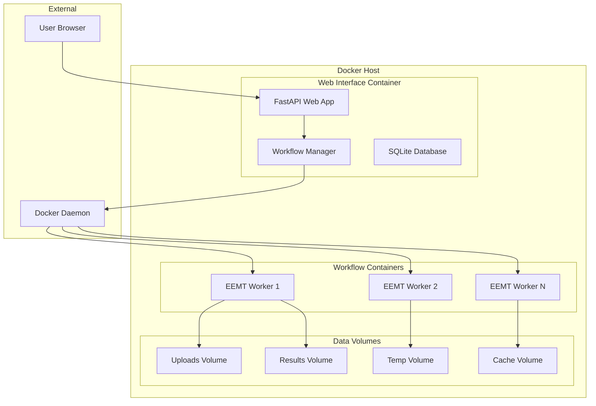

# Web Interface

The EEMT Web Interface provides a modern, user-friendly way to submit and monitor EEMT and solar radiation workflows through a browser-based application with full Docker integration.

## Overview

The web interface is built with **FastAPI** and provides:

- 🌐 **Browser-based Job Submission**: Upload DEM files and configure parameters
- 📊 **Real-time Monitoring**: Track progress with live updates
- 🐳 **Containerized Execution**: Full Docker integration with workflow containers
- 💾 **Results Management**: Download processed data as ZIP archives
- 🏗️ **Scalable Deployment**: Single-node or distributed multi-container architecture

## Docker Deployment (Recommended)

### Quick Start with Docker Compose

The easiest way to deploy EEMT is using Docker Compose, which handles all dependencies and container orchestration:

```bash
# Clone repository
git clone https://github.com/cyverse-gis/eemt.git
cd eemt

# Start local mode (web interface + single worker)
docker-compose up

# Access web interface at http://localhost:5000
```

### Deployment Modes

#### 1. Local Mode (Default)
Single-container deployment for development and small jobs:

```bash
# Start local web interface
docker-compose up eemt-web

# Or build and run manually
docker build -t eemt-web -f docker/web-interface/Dockerfile .
docker run -p 5000:5000 -v $(pwd)/data:/app/data eemt-web
```

#### 2. Distributed Mode
Multi-container deployment with master and worker nodes:

```bash
# Start distributed cluster
docker-compose --profile distributed up

# Scale workers
docker-compose --profile distributed --profile scale up --scale eemt-worker-2=2 --scale eemt-worker-3=3
```

#### 3. Documentation Server
```bash
# Start documentation alongside web interface
docker-compose --profile docs up eemt-docs

# Access docs at http://localhost:8000
```

### Docker Environment Variables

Configure deployment through environment variables:

```bash
# Local mode configuration
EEMT_MODE=local
EEMT_HOST=0.0.0.0
EEMT_PORT=5000

# Distributed mode configuration
EEMT_MODE=master
WORK_QUEUE_PORT=9123
WORK_QUEUE_PROJECT=EEMT-Production
MAX_WORKERS=50

# Worker configuration
MASTER_HOST=eemt-master
MASTER_PORT=9123
WORKER_CORES=8
WORKER_MEMORY=16G
WORKER_DISK=100G
```

## Manual Installation

For development or custom deployments:

### 1. Build Base Container
```bash
# Build EEMT base container with all dependencies
cd docker/ubuntu/24.04/
./build.sh

# Verify image
docker images | grep eemt
```

### 2. Build Web Interface Container
```bash
# Build web interface container
docker build -t eemt-web -f docker/web-interface/Dockerfile .

# Or use pre-built image (if available)
docker pull eemt/web-interface:latest
```

### 3. Run Web Interface
```bash
# Create data directories
mkdir -p data/{uploads,results,temp,cache,shared}

# Run web interface container
docker run -d \
  --name eemt-web \
  -p 5000:5000 \
  -v $(pwd)/data:/app/data \
  -v /var/run/docker.sock:/var/run/docker.sock \
  eemt-web
```

### 4. Access Interface
- **Web Interface**: http://localhost:5000
- **Job Monitor**: http://localhost:5000/monitor
- **API Documentation**: http://localhost:5000/docs

## Features

### Job Submission Interface


- **Workflow Selection**: Choose between Solar Radiation and Full EEMT workflows
- **DEM Upload**: Drag-and-drop or select GeoTIFF files
- **Parameter Configuration**: 
    - Time step (3-15 minutes)
    - Atmospheric turbidity (Linke value)
    - Surface albedo
    - CPU threads
    - Climate data range (EEMT only)

### Real-time Monitoring


- **Summary Dashboard**: Overview of pending, running, completed, and failed jobs
- **Job Table**: Detailed status with progress bars
- **Auto-refresh**: Updates every 5 seconds
- **Job Details**: Click for detailed information and logs

### System Status

The interface automatically checks:

- ✅ Docker daemon availability
- ✅ Container image presence
- ✅ Resource availability
- ⚠️ Setup warnings and instructions

## Workflow Types

### Solar Radiation Modeling

**Purpose**: Calculate daily solar irradiation for topographic analysis

**Process**:
1. Processes DEM through GRASS GIS r.sun
2. Calculates 365 daily solar radiation maps  
3. Generates monthly aggregated products
4. Outputs global and direct solar radiation

**Typical Runtime**: 5-30 minutes depending on DEM resolution

**Outputs**:
- `global/daily/total_sun_day_*.tif` - Daily solar radiation (365 files)
- `global/monthly/total_sun_*_sum.tif` - Monthly aggregates (12 files)
- `insol/daily/hours_sun_day_*.tif` - Daily sunshine hours (365 files)

### Full EEMT Analysis

**Purpose**: Complete energy-mass transfer calculation with climate integration

**Process**:
1. Performs solar radiation calculations
2. Downloads DAYMET climate data
3. Calculates topographic indices (slope, aspect, TWI)
4. Computes EEMT values combining solar and climate data
5. Generates multi-year energy transfer maps

**Typical Runtime**: 1-4 hours depending on time period and resolution

**Outputs**:
- All solar radiation products (above)
- `eemt/EEMT_Topo_*_*.tif` - Topographic EEMT values
- `eemt/EEMT_Trad_*_*.tif` - Traditional EEMT values
- `daymet/` - Downloaded climate data

## Container Architecture

### Execution Flow



### Container Images

#### Base Container (`eemt:ubuntu24.04`)
Contains all scientific computing dependencies:
- **GRASS GIS 8.4+**: With r.sun extensions for solar modeling
- **CCTools 7.8.2**: Makeflow + Work Queue for distributed processing
- **Python 3.12**: Complete geospatial environment with scientific libraries
- **GDAL 3.11**: Modern geospatial data access and format support
- **Workflow Scripts**: Container entry points and scientific computing utilities

#### Web Interface Container (`eemt-web`)
Extends base container with web application:
- **FastAPI Application**: Web interface and REST API
- **Workflow Manager**: Docker orchestration and job management
- **Monitoring Tools**: Real-time progress tracking and log aggregation
- **Docker Integration**: Direct container management capabilities

### Volume Management

Docker Compose automatically creates and manages data volumes:

```yaml
# Volume mounts in docker-compose.yml
volumes:
  - ./data/uploads:/app/uploads      # DEM file uploads
  - ./data/results:/app/results      # Workflow outputs
  - ./data/temp:/app/temp            # Temporary processing data
  - ./data/cache:/app/cache          # Workflow caching
  - ./data/shared:/app/shared        # Shared data (distributed mode)
```

### Container Networking

```yaml
# Docker network configuration
networks:
  eemt-network:
    driver: bridge
```

This allows containers to communicate using service names (e.g., `eemt-master`, `eemt-worker`).

## REST API

The web interface exposes a REST API for programmatic access:

### Submit Job

```http
POST /api/submit-job
Content-Type: multipart/form-data

Parameters:
- workflow_type: "sol" or "eemt"
- dem_file: GeoTIFF file upload
- step: float (time step in minutes)
- linke_value: float (atmospheric turbidity)
- albedo_value: float (surface reflectance)  
- num_threads: int (CPU threads)
- start_year: int (EEMT only)
- end_year: int (EEMT only)
```

### Monitor Jobs

```http
# List all jobs
GET /api/jobs

# Get specific job details
GET /api/jobs/{job_id}

# Download results
GET /api/jobs/{job_id}/results
```

### System Status

```http
GET /api/system/status
```

Returns:
```json
{
  "docker_available": true,
  "container_stats": {
    "total_containers": 2,
    "running_jobs": ["job-123"],
    "system_stats": {
      "cpus": 8,
      "memory": 16777216000
    }
  },
  "image_name": "eemt:ubuntu24.04"
}
```

## Configuration

### Environment Variables

```bash
# Host and port configuration
EEMT_HOST="127.0.0.1"        # Bind address
EEMT_PORT="5000"             # Service port

# Directory configuration
EEMT_UPLOAD_DIR="./uploads"  # DEM upload directory
EEMT_RESULTS_DIR="./results" # Job output directory
EEMT_TEMP_DIR="./temp"       # Temporary processing
EEMT_CACHE_DIR="./cache"     # Workflow cache

# Container configuration  
DOCKER_IMAGE="eemt:ubuntu24.04"  # Container image name
CONTAINER_CPU_LIMIT="4"          # Default CPU limit
CONTAINER_MEMORY_LIMIT="8G"      # Default memory limit
```

### Database Configuration

The interface uses SQLite for job tracking:

- **Location**: `./jobs.db` (auto-created)
- **Schema**: Automatically initialized on first run
- **Backup**: Standard SQLite tools (`sqlite3 .backup`)

## Troubleshooting

### Common Issues

1. **"Docker not available"**
   ```bash
   # Check Docker daemon
   docker info
   
   # Ensure Docker service is running
   sudo systemctl start docker
   ```

2. **"Container image not found"**
   ```bash
   # Build the container
   cd docker/ubuntu/24.04/
   ./build.sh
   
   # Verify image exists
   docker images | grep eemt
   ```

3. **"Job execution failed"**
   - Check job details in monitor for container logs
   - Verify DEM is valid GeoTIFF with proper projection
   - Ensure adequate disk space and memory

4. **"Web interface not accessible"**
   ```bash
   # Check if port is available
   netstat -an | grep 5000
   
   # Try alternative port
   uvicorn app:app --host 127.0.0.1 --port 8080
   ```

### Performance Optimization

- **Large DEMs**: Consider processing smaller tiles
- **Concurrent Jobs**: Limit based on available CPU/memory
- **Container Resources**: Adjust limits in `workflow_manager.py`
- **Disk Space**: Monitor usage in uploads/, results/, temp/

### Logging

Application logs are available:

```bash
# Start with debug logging
uvicorn app:app --log-level debug

# Container execution logs  
docker logs <container_id>

# Job-specific logs in web interface monitor
```

## Development

### API Development

The FastAPI application supports:

- **Auto-documentation**: Available at `/docs`
- **Interactive testing**: Try API endpoints in browser
- **OpenAPI schema**: Available at `/openapi.json`

### Frontend Development

The HTML interface uses:

- **Bootstrap 5**: Responsive CSS framework
- **Vanilla JavaScript**: No heavy frontend dependencies
- **WebSocket**: For real-time progress updates (planned)

### Container Development

To modify container workflows:

1. Edit scripts in `docker/ubuntu/24.04/container-scripts/`
2. Rebuild container: `./build.sh`
3. Test with web interface

## Integration

### Distributed Mode

The web interface can be integrated with distributed computing environments:

- **Multi-host execution**: Deploy master node with web interface, connect remote workers
- **Load balancing**: Work Queue automatically distributes tasks across available workers
- **Fault tolerance**: Automatic retry and worker replacement mechanisms
- **HPC Integration**: Connect to SLURM, PBS, LSF batch schedulers

See [Distributed Deployment](../distributed-deployment/index.md) for complete setup guide.

### Master Node Configuration

To run the web interface as a master node:

```python
from containers.workflow_manager import DistributedWorkflowManager, NodeType, MasterConfig

# Configure master with web interface
master_config = MasterConfig(
    port=9123,
    max_workers=100,
    work_queue_project="EEMT-Cluster"
)

# Initialize master workflow manager  
master = DistributedWorkflowManager(
    base_dir=Path("/data/eemt-master"),
    node_type=NodeType.MASTER,
    master_config=master_config
)

# Start master node
master.start_master_node()
```

Workers can then connect from remote machines:

```bash
# Start worker on remote machine
python scripts/start-worker.py \
    --master-host your-master-ip \
    --master-port 9123 \
    --cores 8 --memory 16G
```

### Cloud Deployment

Cloud integration examples:

- **Kubernetes**: Container orchestration with persistent volumes
- **AWS/GCP/Azure**: VM clusters with shared storage
- **Singularity**: HPC container deployment

See [PLAN.md](../../PLAN.md) for complete modernization roadmap.

## Job Data Management

The web interface includes comprehensive job data lifecycle management through an automated cleanup system. This ensures optimal disk usage while preserving important job metadata.

### Cleanup System Features

- **Automated retention policies**: 7-day retention for successful jobs, 12-hour for failed jobs
- **Selective data deletion**: Removes output data while preserving job configurations
- **Multiple trigger methods**: API endpoints, scheduled tasks, or manual execution
- **Container integration**: Works seamlessly with Docker deployments
- **Comprehensive logging**: Full audit trail of cleanup operations

### Quick Cleanup Setup

Enable automated cleanup with default settings:

```bash
# Navigate to web interface directory
cd web-interface/

# Set up automated cleanup (runs daily at 2 AM)
./setup_cleanup_cron.sh --user --method cron

# Test cleanup in dry-run mode
python cleanup_jobs.py --dry-run
```

Or configure via Docker Compose:

```yaml
services:
  eemt-web:
    environment:
      - EEMT_SUCCESS_RETENTION_DAYS=7
      - EEMT_FAILED_RETENTION_HOURS=12
      - EEMT_ENABLE_AUTO_CLEANUP=true
```

### Cleanup API Endpoint

Trigger cleanup programmatically:

```bash
# Manual cleanup via API
curl -X POST http://localhost:5000/api/cleanup

# Dry run with custom retention
curl -X POST http://localhost:5000/api/cleanup \
  -H "Content-Type: application/json" \
  -d '{"dry_run": true, "success_retention_days": 3}'
```

### Related Documentation

For detailed information about the cleanup system:

- [Job Cleanup Reference](./job-cleanup.md) - Complete cleanup system documentation
- [Cleanup Scripts Guide](../getting-started/cleanup-scripts.md) - Step-by-step usage instructions
- [Docker Integration](../docker/cleanup-integration.md) - Container-specific deployment
- [Infrastructure Details](../infrastructure/job-cleanup.md) - System architecture and implementation

## Summary

The EEMT web interface provides a modern, containerized solution for managing EEMT workflows with features including:

- **Browser-based job submission** with real-time monitoring
- **Docker integration** for reliable, reproducible execution
- **Automated data cleanup** to maintain system performance
- **REST API** for programmatic access
- **Scalable architecture** supporting single-node to distributed deployments

The combination of user-friendly interface, container orchestration, and intelligent data management ensures your EEMT deployment remains efficient and maintainable at any scale.